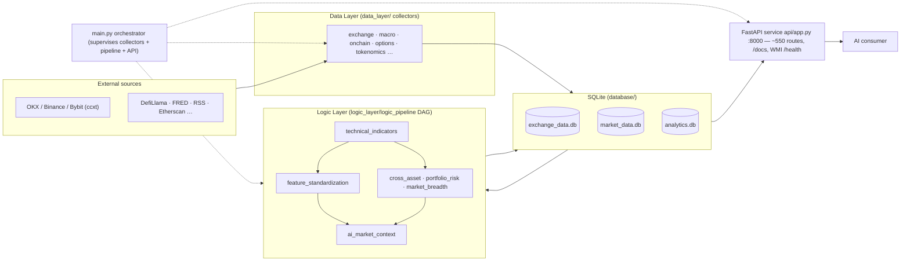

# AGENTS.md

## Cursor Cloud specific instructions

EvoQuant is a Python crypto-market "world model" data platform: data-layer collectors ingest
market/derivatives/on-chain/macro data, a logic-layer DAG computes features/indicators, and a
FastAPI service (`api/app.py`) serves quality-tagged market context to AI consumers. Storage
defaults to embedded SQLite, so no external database is required for local dev.

Standard commands live in the `Makefile` (`make test|lint|typecheck|api|dev|modules`), `api/README.md`,
and `README.md`. The notes below are only the non-obvious caveats.

### Architecture & data flow

### Environment / dependencies
- The VM runs Python 3.12 (project targets 3.11 in CI, but it installs and runs fine on 3.12). Work
  inside the virtualenv at `.venv` (`source .venv/bin/activate`).
- Dependency install order matters: `requirements-dev.txt` pins `safety==3.2.14`, which requires
  `pydantic<2.10`, conflicting with the runtime pin `pydantic==2.10.6`. Install `requirements.txt`
  **last** so the runtime `pydantic 2.10.6` wins. `safety` (a security scanner, unused for
  lint/test/build/run) is left with a harmless resolver warning; ignore it.

### Databases
`DB_BACKEND` defaults to `sqlite` in `config/settings.py`, even though `.env.example` sets `postgres`.
For local dev do **not** copy `.env` to enable Postgres unless you actually start one; the SQLite
files are auto-created under `database/`.

| Setting | Default | Notes |
| --- | --- | --- |
| `DB_BACKEND` | `sqlite` | `postgres` only if you run a PG instance; `.env.example` misleadingly sets `postgres` |
| `DB_SPLIT_ENABLED` | `1` | `1` = 3 files below; `0` = single `crypto_data.db` (CI uses `0` for tests) |
| `exchange_data.db` | — | raw exchange data (klines, tickers, funding, orderbook, OI, basis, trades) |
| `market_data.db` | — | merged klines / market-wide series |
| `analytics.db` | — | pipeline outputs (ai_market_context, market_structure, breadth, liquidation …) |

### Running services & dev tasks (SQLite, no secrets needed)

| Task | Command | Notes |
| --- | --- | --- |
| API only | `python -m api.app --port 8000` | Swagger at `/docs`; endpoints read the DB live, so data collected after startup shows up with no restart |
| Full orchestration | `python main.py` (`make dev`) | Runs collectors + logic pipeline + API as supervised subprocesses |
| Collect market data | `python -m data_layer.exchange_data.runner --mode once` | Add `--mode bootstrap` for historical klines; `--skip-backfill` for a fast connectivity check |
| Run logic pipeline | `python -m logic_layer.logic_pipeline.runner --mode once` | Computes features from collected klines into `analytics.db` |
| List modules | `python main.py --list-modules` (`make modules`) | — |
| Lint | `ruff check .` (`make lint`) | Pre-existing failures — see below |
| Typecheck | `mypy api/ database/ config/ --ignore-missing-imports` (`make typecheck`) | Pre-existing failures |
| Tests | `DB_SPLIT_ENABLED=0 pytest tests/ -q --ignore=tests/tokenomics_data --ignore=tests/exchange_data --ignore=tests/onchain_data` (`make test`) | ~327 pass, 3 pre-existing failures |

### API usage gotchas
- Symbol path params use `BASE-QUOTE`, e.g. `/exchange/ticker/BTC-USDT` (not `BTC/USDT` or `BTCUSDT`).
- Many endpoints default to `exchange=binance`; pass `?exchange=okx` when Binance data is absent.

### Network / exchange reachability (important for data collection)
From this VM only OKX is reachable. The exchange collector raises fatally when Binance is enabled,
and the exchange list (`config/symbols.py:TARGET_EXCHANGES`, `config/settings.py:EXCHANGE_CONFIG`)
is hardcoded with no env override. To collect real data here, temporarily disable Binance/Bybit
(`enabled: False`) and reduce `TARGET_EXCHANGES` to `okx`, then **revert before committing**.

| Exchange | Status from CI VM | Effect |
| --- | --- | --- |
| OKX | ✅ reachable | Use this for live data collection |
| Binance | ❌ HTTP 451 (geo-block) | Collector aborts fatally if enabled |
| Bybit | ❌ HTTP 403 (CloudFront) | No data returned |

### Pre-existing failures (NOT environment problems)
CI is red on `main` and feature branches; these are code/test issues, not setup issues.

| Area | Symptom | Root cause |
| --- | --- | --- |
| Lint | `ruff check .` reports hundreds of errors | Pre-existing unused imports (`F401`), `E402`, etc. |
| Typecheck | `mypy` reports many errors | Pre-existing type issues across `api/` etc. |
| Tests | ~3 of ~330 tests fail | Test/code drift (e.g. expected table `funding_rate_snapshots` vs actual `funding_model_snapshots`) |
| Pipeline | `/technical/indicators/*` returns "No indicator data" | Bug in `logic_layer/technical_indicators/repository.py` — `save_merged_klines` calls `.strftime()` on a pandas `Series` instead of `.dt.strftime()` |
