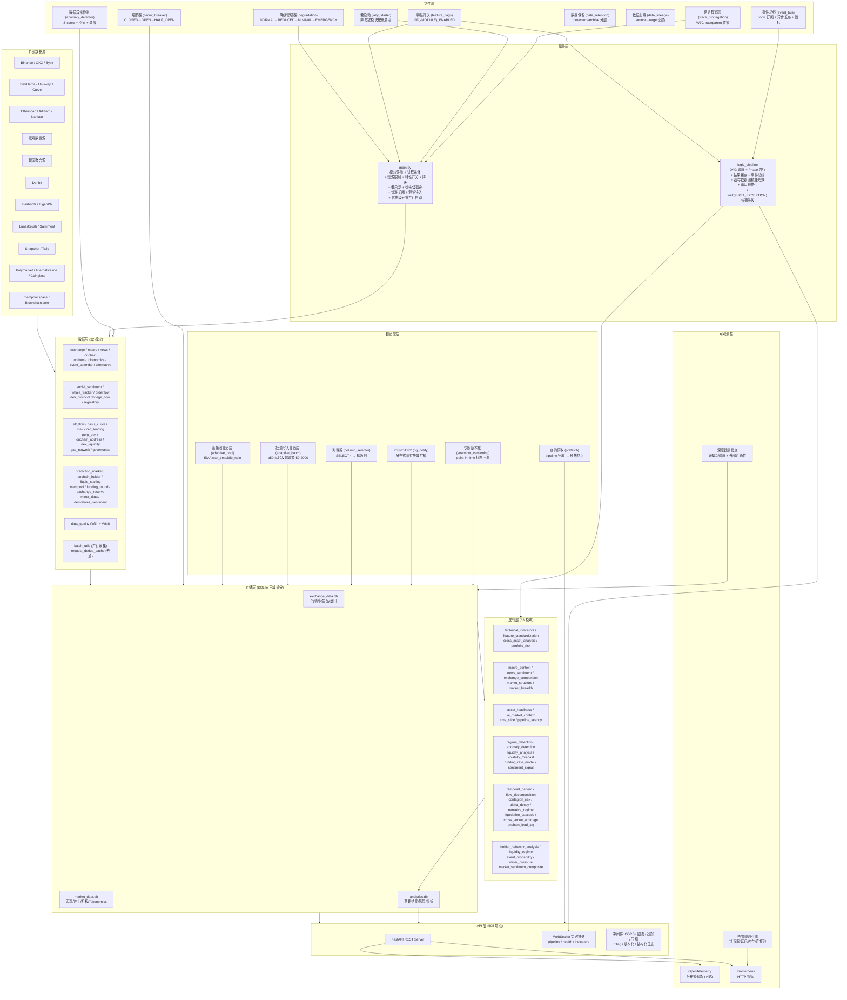
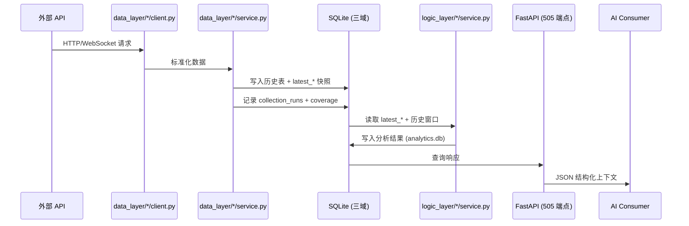
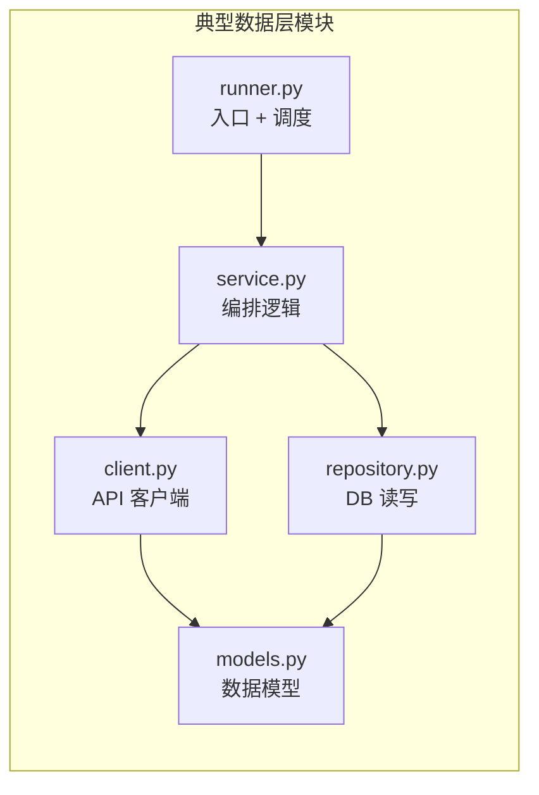
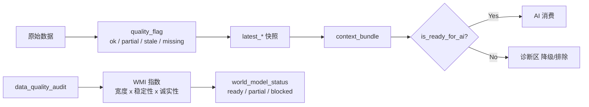
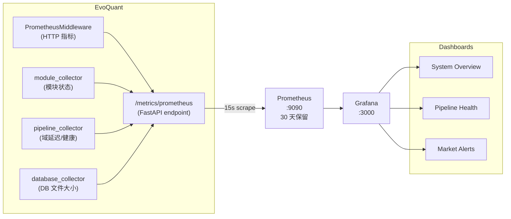
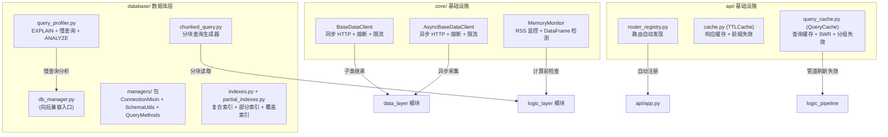
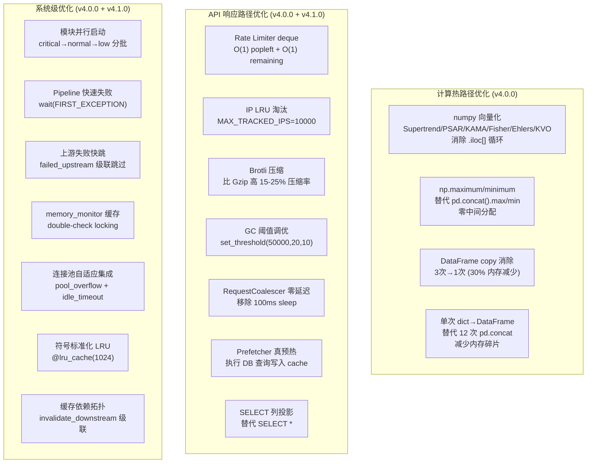

# EvoQuant 架构图

## 系统总览

## 数据流

## 逻辑管道调度 (DAG)

## 模块内部结构

## 质量治理流

## 进程管理

## 监控与可观测性

**指标采集链路：**
- HTTP 中间件 → `evoquant_http_requests_total` / `_duration_seconds` / `_in_progress`
- main.py 后台线程（15s）→ `evoquant_module_status` / `_restart_count` / `_uptime_seconds`
- /metrics/prometheus 后台线程（15s）→ `evoquant_domain_*` / `evoquant_wmi_score` / `evoquant_database_size_bytes`
- logic_pipeline 阶段回调 → `evoquant_pipeline_phase_duration_seconds` / `_total_duration_seconds`

## 基础设施层 (v3.4.0)

**v3.4.0 新增组件：**
- `core/async_base_data_client.py` — 异步 HTTP 客户端基类（AsyncCircuitBreaker + AsyncRateLimiter）
- `core/memory_monitor.py` — 进程内存监控（psutil）+ DataFrame 大小检测
- `database/managers/` — DBManager Mixin 模块化拆分（ConnectionMixin/SchemaUtilsMixin/QueryMethodsMixin）
- `database/query_profiler.py` — EXPLAIN QUERY PLAN 分析 + 自动 ANALYZE + 慢查询统计
- `database/partial_indexes.py` — 部分索引（热数据窗口）+ 覆盖索引（避免回表）
- `database/chunked_query.py` — 分块查询生成器（chunked_fetch / chunked_fetch_df）
- `api/router_registry.py` — 路由自动发现（pkgutil 扫描）
- `api/query_cache.py` 增强 — invalidate_prefix + invalidate_group + stale-while-revalidate

## 性能优化层 (v4.0.0 ~ v4.3.0)

**v4.0.0 关键改动：**
- `logic_layer/technical_indicators/calculator.py` — 7 个核心循环函数向量化（_supertrend/_parabolic_sar/_kama/_fisher_transform/_ehlers_*/_klinger_volume_oscillator/_positive_negative_volume_index）
- `api/app.py` — _RateLimiter 重写为 deque + LRU 淘汰 + Brotli 压缩 + GC 调优
- `logic_layer/logic_pipeline/service.py` — _run_phase_parallel 改用 wait(FIRST_EXCEPTION)
- `main.py` — supervise_modules 按优先级分批并行启动
- `core/memory_monitor.py` — rss_mb 添加 1s 结果缓存
- `database/pool_config.py` — 新增 adaptive_enabled/pool_overflow/idle_timeout + get_adaptive_pool_size()
- `requirements.txt` — 新增 numpy==1.26.4 / starlette-compress==1.0.1 / bottleneck==1.4.2

**v4.1.0 关键改动：**
- `api/routers/aggregate.py` — SELECT * 改为列投影 + _SYMBOL_INDEX 预索引 O(1) 查找
- `api/request_coalescer.py` — 移除首次请求的 time.sleep(100ms)，零延迟直接执行
- `api/prefetch.py` — prefetch_all() 真正执行 DB 查询写入 query_cache
- `api/query_cache.py` — 新增 register_dependency() / invalidate_downstream() 级联失效
- `api/app.py` — remaining() 改为 O(1) deque len 计算
- `logic_layer/logic_pipeline/service.py` — 新增 _MODULE_DEPENDENCIES + failed_upstream 快跳
- `logic_layer/market_breadth/service.py` — _normalize_asset_from_symbol 添加 @lru_cache
- `data_layer/exchange_data/service.py` — _build_symbols_map 预分配 + 直接索引
- `core/memory_monitor.py` — double-check locking 防止并发 syscall

**v4.2.0 关键改动：**
- `logic_layer/feature_standardization/service.py` — O(n²) 逐 symbol 过滤改为 groupby 一次分组 + .values[-1] 替代 .iloc[-1]
- `api/websocket_manager.py` — orjson 快速序列化路径，broadcast 只 encode 一次
- `core/event_bus.py` — handler 缓存 tuple + 10ms 轮询 + 延迟日志格式化
- `database/backends/postgres_backend.py` — _DictRow __slots__ + tuple columns 缓存 + tuple(values)
- `api/query_cache.py` — _inflight_lock 独立锁，缓存读写与 inflight 管理互不阻塞

**v4.3.0 关键改动：**
- `api/routers/aggregate.py` — correlation-context N+1 查询（18次 DB）合并为单次全量查询 + 内存分组
- `logic_layer/cross_asset_analysis/service.py` — run_all() 预加载共享数据，消除 3 次重复 DB 调用
- `logic_layer/technical_indicators/repository.py` — open_time 向量化预转换替代逐行 pd.Timestamp()
- `main.py` — shutdown 信号前置检查，避免无效子进程轮询
- `config/symbols.py` — ALL_SECTOR_SYMBOLS frozenset 预计算
- `api/routers/prediction_market.py` / `liquidation_cascade.py` — SELECT * 全部改为列投影
- `logic_layer/result_cache.py` — 短 key (≤128) 跳过 SHA-256 直接用原始字符串
- `logic_layer/technical_indicators/service.py` — loguru import 提升至模块级

**v4.4.0 关键改动：**
- `logic_layer/cross_asset_analysis/calculator.py` — compute_correlation_matrix 从 O(n²) 纯 Python 循环改为 numpy corrcoef 一次向量化计算 (10-100×)
- `api/dependencies.py` — 新增 6 个 @lru_cache 服务单例（liquidity_regime/liquidation_cascade/holder_behavior/miner_pressure/flow_decomposition/temporal_pattern）
- `api/routers/` (6 个 context 端点) — 逐请求 Service() + close() 改为单例注入，消除 50-200ms/请求实例化开销
- `logic_layer/cross_asset_analysis/repository.py` — json.dumps/loads 替换为 orjson 快速路径 (3-5× 加速)
- `logic_layer/time_slice/service.py` — 3 次 sum() generator 改为 Counter 单次遍历
- `core/memory_monitor.py` — 缓存 TTL 从固定 1s 改为 MEMORY_CACHE_TTL_SECONDS 环境变量 (默认 5s)
- `api/routers/` (12 个端点) — liquidity_regime/holder_behavior/miner_pressure/orderflow_micro/stablecoin_flow/prediction_market SELECT * → 列投影

**v4.5.0 关键改动：**
- `api/routers/volatility.py` — ranking 端点 N+1 查询合并为单次 IN(...) 批量查询 + 内存分组 (5-10×)
- `api/routers/factor_explorer.py` — 手动 Pearson 循环改为 np.corrcoef() 向量化 (10-50×)
- `logic_layer/news_sentiment/classifier.py` — 逐词 `kw in text` 改为预编译正则 findall 单次扫描 (3-5×)
- `logic_layer/technical_indicators/enricher.py` — groupby sort=False + 辅助 DataFrame 预分组 dict 查找替代 boolean mask
- `api/fair_limiter.py` — metrics() set(list+list) 改为 dict_keys 视图并集
- `api/pagination.py` — cursor 编解码 json.dumps/loads 替换为 orjson 快速路径

**v4.6.0 关键改动：**
- `logic_layer/feature_standardization/service.py` — 跨资产排名 O(n²) 嵌套循环改为预建 feature_name→rows 索引 O(n) + Counter 替代手动 regime 计数 + orjson 序列化
- `logic_layer/portfolio_risk/calculator.py` — O(n²) 协方差矩阵循环改为 numpy `w @ cov @ w` 矩阵乘法 (30-50×)
- `logic_layer/cross_asset_analysis/service.py` — fund_flow 多次 sum(get()) 改为单次遍历 flow_map 预聚合 tier/sector 数组
- `logic_layer/asset_readiness/service.py` — 12 次 set() | set() 改为单个 set 累加器 .update() 链
- `main.py` — 3 次 list comprehension 优先级分组改为单次循环 dict 累加
