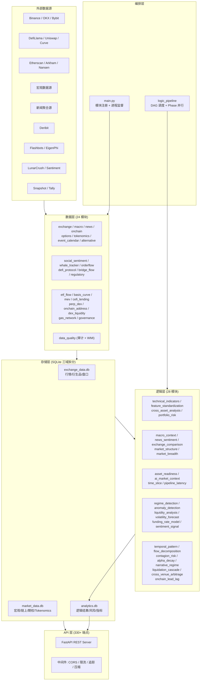
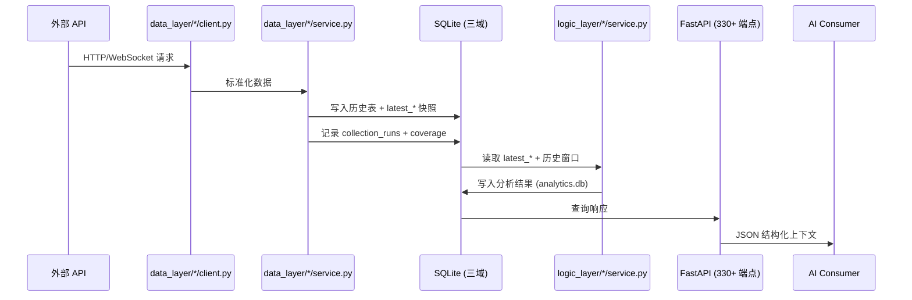
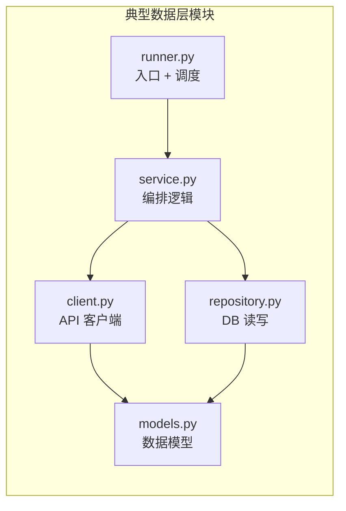
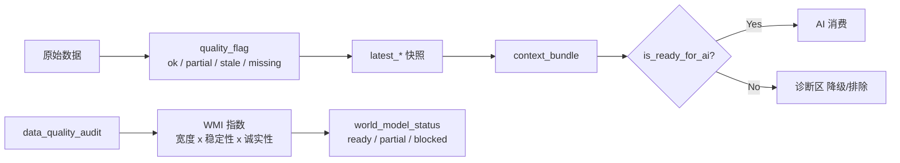
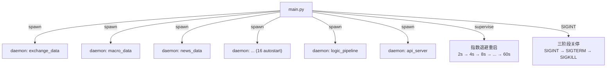

# EvoQuant 架构图

## 系统总览

```mermaid
graph TB
    subgraph External["外部数据源"]
        EX_CEX["Binance / OKX / Bybit"]
        EX_DEFI["DefiLlama / Uniswap / Curve"]
        EX_ONCHAIN["Etherscan / Arkham / Nansen"]
        EX_MACRO["宏观数据源"]
        EX_NEWS["新闻聚合源"]
        EX_OPTIONS["Deribit"]
        EX_MEV["Flashbots / EigenPhi"]
        EX_SOCIAL["LunarCrush / Santiment"]
        EX_GOV["Snapshot / Tally"]
    end

    subgraph DataLayer["数据层 (24 模块)"]
        DL_CORE["exchange / macro / news / onchain\noptions / tokenomics / event_calendar / alternative"]
        DL_EXT["social_sentiment / whale_tracker / orderflow\ndefi_protocol / bridge_flow / regulatory"]
        DL_NEW["etf_flow / basis_curve / mev / cefi_lending\nperp_dex / onchain_address / dex_liquidity\ngas_network / governance"]
        DL_QUALITY["data_quality (审计 + WMI)"]
    end

    subgraph Storage["存储层 (SQLite 三域拆分)"]
        DB_EX["exchange_data.db\n行情/衍生品/盘口"]
        DB_MK["market_data.db\n宏观/链上/期权/Tokenomics"]
        DB_AN["analytics.db\n逻辑结果/风险/指标"]
    end

    subgraph LogicLayer["逻辑层 (28 模块)"]
        LL_CORE["technical_indicators / feature_standardization\ncross_asset_analysis / portfolio_risk"]
        LL_CONTEXT["macro_context / news_sentiment / exchange_comparison\nmarket_structure / market_breadth"]
        LL_AI["asset_readiness / ai_market_context\ntime_slice / pipeline_latency"]
        LL_ANALYSIS["regime_detection / anomaly_detection\nliquidity_analysis / volatility_forecast\nfunding_rate_model / sentiment_signal"]
        LL_ADVANCED["temporal_pattern / flow_decomposition\ncontagion_risk / alpha_decay / narrative_regime\nliquidation_cascade / cross_venue_arbitrage\nonchain_lead_lag"]
    end

    subgraph API["API 层 (330+ 端点)"]
        API_REST["FastAPI REST Server"]
        API_MW["中间件: CORS / 限流 / 追踪 / 压缩"]
    end

    subgraph Orchestration["编排层"]
        MAIN["main.py\n模块注册 + 进程监督"]
        PIPELINE["logic_pipeline\nDAG 调度 + Phase 并行"]
    end

    External --> DataLayer
    DataLayer --> Storage
    Storage --> LogicLayer
    LogicLayer --> DB_AN
    Storage --> API
    DB_AN --> API
    MAIN --> DataLayer
    PIPELINE --> LogicLayer
```

## 数据流

```mermaid
sequenceDiagram
    participant Ext as 外部 API
    participant Client as data_layer/*/client.py
    participant Service as data_layer/*/service.py
    participant DB as SQLite (三域)
    participant Logic as logic_layer/*/service.py
    participant API as FastAPI (330+ 端点)
    participant AI as AI Consumer

    Ext->>Client: HTTP/WebSocket 请求
    Client->>Service: 标准化数据
    Service->>DB: 写入历史表 + latest_* 快照
    Service->>DB: 记录 collection_runs + coverage
    DB->>Logic: 读取 latest_* + 历史窗口
    Logic->>DB: 写入分析结果 (analytics.db)
    DB->>API: 查询响应
    API->>AI: JSON 结构化上下文
```

## 逻辑管道调度 (DAG)

```mermaid
graph LR
    subgraph Phase1["Phase 1 串行"]
        TI["technical_indicators"]
    end

    subgraph Phase2["Phase 2 并行"]
        FS["feature_standardization"]
        CA["cross_asset_analysis"]
        MC["macro_context"]
        NS["news_sentiment"]
        EC["exchange_comparison"]
        MS["market_structure"]
        RD["regime_detection"]
        AD["anomaly_detection"]
        LA["liquidity_analysis"]
        VF["volatility_forecast"]
        FR["funding_rate_model"]
        SS["sentiment_signal"]
        TP["temporal_pattern"]
        FD["flow_decomposition"]
        CR["contagion_risk"]
        ALD["alpha_decay"]
        NR["narrative_regime"]
        LC["liquidation_cascade"]
        CVA["cross_venue_arbitrage"]
        OLL["onchain_lead_lag"]
    end

    subgraph Phase3["Phase 3 串行"]
        MB["market_breadth"]
        PR["portfolio_risk"]
    end

    subgraph Phase4["Phase 4 串行"]
        AR["asset_readiness"]
    end

    subgraph Phase5["Phase 5 串行"]
        AMC["ai_market_context"]
    end

    Phase1 --> Phase2
    Phase2 --> Phase3
    Phase3 --> Phase4
    Phase4 --> Phase5
```

## 模块内部结构

```mermaid
graph LR
    subgraph Module["典型数据层模块"]
        R["runner.py\n入口 + 调度"]
        S["service.py\n编排逻辑"]
        C["client.py\nAPI 客户端"]
        M["models.py\n数据模型"]
        RP["repository.py\nDB 读写"]
    end

    R --> S
    S --> C
    S --> RP
    C --> M
    RP --> M
```

## 质量治理流

```mermaid
graph LR
    RAW["原始数据"] --> QF["quality_flag\nok / partial / stale / missing"]
    QF --> LATEST["latest_* 快照"]
    LATEST --> BUNDLE["context_bundle"]
    BUNDLE --> READY{"is_ready_for_ai?"}
    READY -->|Yes| AI["AI 消费"]
    READY -->|No| DIAG["诊断区 降级/排除"]

    DQA["data_quality_audit"] --> WMI["WMI 指数\n宽度 x 稳定性 x 诚实性"]
    WMI --> WORLD["world_model_status\nready / partial / blocked"]
```

## 进程管理

```mermaid
graph TB
    MAIN["main.py"] --> |spawn| D1["daemon: exchange_data"]
    MAIN --> |spawn| D2["daemon: macro_data"]
    MAIN --> |spawn| D3["daemon: news_data"]
    MAIN --> |spawn| DN["daemon: ... (16 autostart)"]
    MAIN --> |spawn| LP["daemon: logic_pipeline"]
    MAIN --> |spawn| API["daemon: api_server"]

    MAIN --> |supervise| RESTART["指数退避重启\n2s → 4s → 8s → ... → 60s"]
    MAIN --> |SIGINT| GRACEFUL["三阶段关停\nSIGINT → SIGTERM → SIGKILL"]
```
