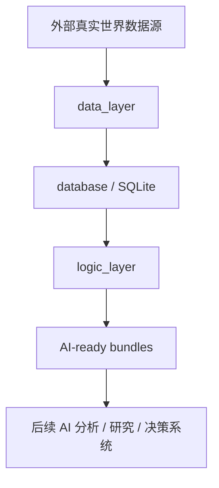
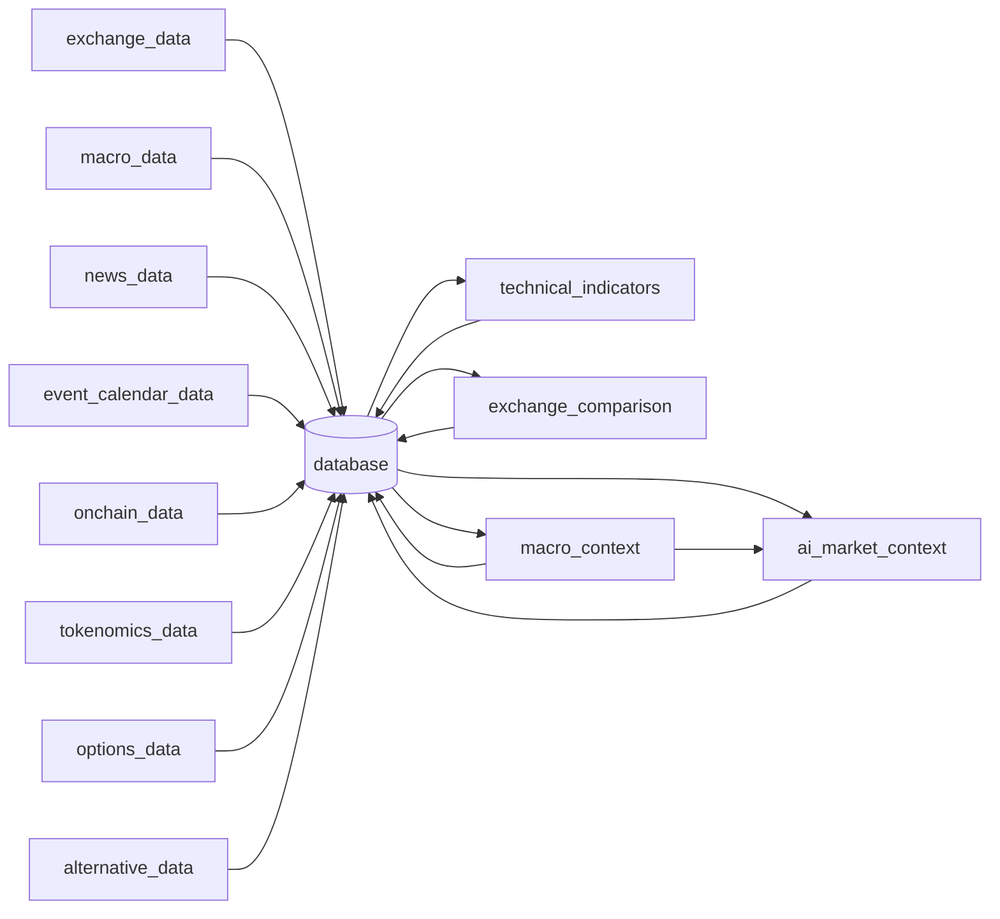
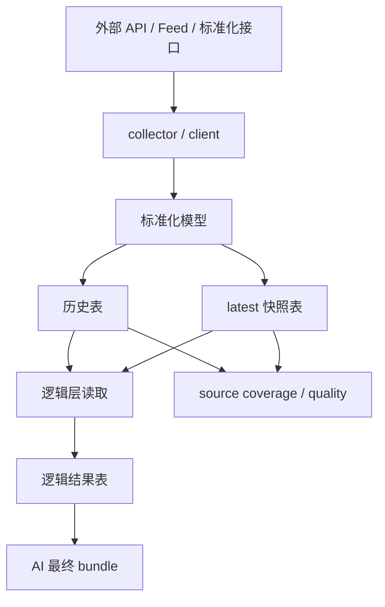

# 项目总文档

## 面向对象

这份文档面向三类读者：

1. 第一次接触本项目的新成员。
2. 需要快速判断项目价值与可扩展性的投资人。
3. 需要在现有代码基础上继续扩展数据、逻辑或 AI 供数链路的工程团队。

## 文档定位

这不是一份简短的 README，也不是只给开发者看的接口说明。

这是一份面向项目整体的长篇项目说明文档，目标是把下面几件事一次性讲清楚：

- 这个项目到底在做什么。
- 为什么这个项目对 AI 驱动的加密市场分析有价值。
- 当前代码仓库里已经有哪些真实实现。
- 各模块之间如何协作。
- 数据如何从外部世界进入系统、变成结构化快照，再变成 AI 可以直接消费的上下文。
- 当前架构为什么这样设计。
- 这套系统的技术护城河、工程护城河和数据护城河分别在哪里。
- 当前边界、短板、风险和下一阶段最合理的扩张方向是什么。

## 版本说明

- 文档生成基于当前仓库状态：`2026-05-28`
- 项目根目录：`EvoQuant/`
- 当前数据库路径：`database/crypto_data.db`
- 当前默认目标交易对：18 个币种（BTC、ETH、SOL、SUI、DOGE、XRP、AVAX、LINK、ADA、DOT、POL、UNI、ARB、OP、NEAR、ATOM、APT、TIA）
- 当前默认目标交易所：`binance`、`okx`、`bybit`

---

# 第一部分：先用一句话理解项目

这个项目本质上不是一个“交易机器人”，也不是一个“新闻爬虫合集”，更不是一个“单一指标计算器”。

它的本质，是一个面向 AI 的加密市场数据基础设施项目。

更具体地说，它正在做三件事：

1. 从多个外部世界持续采集真实市场数据、宏观数据、链上数据、新闻事件数据、期权数据、供给侧数据和补充特征数据。
2. 把这些异构数据清洗、标准化、落库，并维护适合 AI 读取的 `latest_*` 快照表和 bundle。
3. 在逻辑层把分散数据进一步重组，生成 AI 可以直接消费的结构化市场上下文。

如果把这个项目放在更大的系统分工里，它处于下面这个位置：

```text
真实世界 -> 数据层采集与标准化 -> 数据库与 latest 快照 -> 逻辑层重组 -> AI 分析 -> 交易决策/执行
```

当前仓库已经覆盖了前四段中的绝大部分工作。

也就是说，这个项目已经不只是“原始数据抓取脚本集合”，而是在向“AI 原生量化数据中台”演进。

---

# 第二部分：执行摘要

## 2.1 一句话执行摘要

这是一个围绕“让 AI 更好理解加密市场”的数据基础设施项目，核心竞争力不是单一来源，而是跨来源、跨时间尺度、跨资产类别的数据统一、质量治理和 AI-ready 供数能力。

## 2.2 当前仓库的真实规模

基于当前仓库扫描结果，本项目已经具备以下规模特征：

| 指标 | 当前值 |
| --- | --- |
| 顶层主入口 | `main.py` |
| 自动启动常驻模块 | 11 个（9 数据 + 逻辑编排 + API） |
| 手动触发逻辑模块 | 11 个 |
| 逻辑处理层模块 | 14 个 |
| SQLite 表数量 | 53+ 张（三域拆分） |
| Python 源文件数量 | 248 个 |
| Markdown 文档数量 | 53 个 |
| JSON 注册表数量 | 10 个 |
| 测试文件数量 | 54 个 |
| 默认交易所数量 | 3 家 |
| 默认目标交易资产 | 18 个主流资产（三层分频） |

## 2.3 当前系统能覆盖哪些市场证据

从 AI 市场分析视角看，当前系统已经覆盖下列八大证据带：

1. 现货与盘口微观结构。
2. 永续/衍生品拥挤度与被动压力。
3. 新闻、公告、治理、监管与未来事件。
4. 宏观跨市场风险偏好与流动性背景。
5. 链上资金流、储备、桥流、TVL、网络使用、质押、DEX 交易量与稳定币供给。
6. Tokenomics 供给、解锁、质押率与国库钱包流。
7. 期权隐含波动率、墙位、Gamma、流量和到期结构。
8. 注意力、开发者活跃度和稳定币供给脉冲。

绝大多数所谓“AI 交易系统”在真实落地时，失败并不是因为模型本身不够聪明，而是因为喂给模型的市场世界观过于单薄。

这个项目正在解决的，恰恰是那个更根本的问题：

不是先讨论模型，而是先建立足够宽、足够稳、足够诚实的数据世界模型。

## 2.4 当前项目最重要的架构特征

从架构上看，这个项目有几个非常鲜明的特点：

### 特点一：分层非常清晰

- `data_layer` 只做外部数据获取、标准化和落库。
- `logic_layer` 只做计算、聚合和 AI 上下文准备。
- `database` 统一承载表结构、快照与持久化契约。
- `config` 统一管理目标资产、交易所、调度周期和环境变量入口。

### 特点二：大量使用 `latest_*` 快照表

这意味着项目不是单纯在存历史数据，而是在刻意为“当前时刻的 AI 决策读取”建立低复杂度入口。

例如：

- `latest_tickers`
- `latest_funding_rates`
- `latest_orderbook_snapshots`
- `latest_trade_flow_bars`
- `latest_open_interest_snapshots`
- `latest_liquidation_bars`
- `latest_positioning_snapshots`
- `latest_basis_snapshots`
- `latest_macro_timeseries`
- `latest_onchain_timeseries`
- `latest_tokenomics_timeseries`
- `latest_options_timeseries`
- `latest_alternative_timeseries`

这类表的价值非常现实：

- AI 不需要每次都扫整张历史表找最新一条。
- 模块间依赖更明确。
- 可以更容易做 freshness 和 stale 判断。
- 可以把“当前世界是什么样”与“历史轨迹是什么样”解耦。

### 特点三：把“数据质量是否足够给 AI 用”提升成架构级主题

这是本项目最值得强调的差异化。

很多系统只做两件事：

1. 采到数据。
2. 存到数据库。

但对 AI 交易分析来说，这远远不够。

因为“数据库里有值”不等于“这个值适合给 AI 直接做交易判断”。

本项目已经将这一问题结构化为三层机制：

1. `health_status`
   - 判断一个来源最近是否在健康运行。
2. `quality_flag`
   - 判断 latest 快照样本本身是 `ok`、`partial`、`fallback`、`stale` 还是 `unknown`。
3. `is_ready_for_ai`
   - 判断这一路 source 是否真的达到了可以直接供 AI 使用的门槛。

这三层区分，极其关键。

因为在实际量化系统里，最危险的情况往往不是“没有数据”，而是“看起来有数据，但质量门槛不够高，模型却把它当真了”。

### 特点四：显式区分“AI 主视图”和“原始真实诊断视图”

这是本项目另一个非常重要的工程选择。

很多 bundle 中都会同时出现：

- AI 直接消费字段。
- `raw_*` 字段。
- `ai_excluded_sources`
- `source_health`
- `quality_notes`

这意味着项目并不会：

- 为了让数据看起来更完整而伪造不存在的数据。
- 为了让 AI 输出更稳定而隐瞒真实缺口。
- 把“不够好但真实存在”的数据直接硬塞给 AI 主视图。

相反，它选择更成熟的一条路：

- 真实采到的都保留。
- 但是哪些可以直接喂给 AI，哪些只能作为诊断，要分开呈现。

这既是工程质量，也是风控思维。

## 2.5 当前项目适合怎样的投资叙事

如果从投资人的角度看，这个项目不是在赌某一个单次策略信号，而是在搭建一层更底层、更可复用的市场智能基础设施。

它的价值不是：

- “某个指标今天赢了多少”。

而是：

- “未来任何一个 AI 策略、研究模型、交易代理，都可以在这层真实数据能力之上构建”。

也就是说，这个项目更像：

- AI 量化基础设施。
- 加密市场数据中台。
- 面向代理型 AI 的市场世界模型生成器。

这决定了它的长期价值不只来自单次交易表现，而来自下面这些复利机制：

1. 新来源接入后，可以立刻进入统一质量框架。
2. 新模型接入后，可以直接消费既有 bundle，而不必重复做数据工程。
3. 新资产、新交易所、新链、新叙事引入时，可以复用既有目录、表和诊断逻辑。
4. 历史积累越久，训练、回测、解释和监控能力越强。

---

# 第三部分：项目要解决的核心问题

## 3.1 AI 直接做市场分析为什么难

如果只从表面看，“让 AI 分析市场”似乎只需要把价格、新闻和几个指标给模型即可。

但在真实量化场景里，这个问题比表面复杂得多。

AI 面临的真正难点包括：

1. 价格不是市场的全部。
2. 同一价格在不同交易所上的含义不同。
3. 永续资金费率、持仓量、清算和 Basis 会改变价格的可解释性。
4. 宏观风险偏好会改变加密价格波动的外部背景。
5. 新闻和未来事件会改变短期催化剂结构。
6. 链上资金流和交易所储备会改变筹码供给理解。
7. Tokenomics 解锁与国库钱包行为会改变供给预期。
8. 期权市场通常比现货更早定价波动与尾部风险。
9. 注意力、开发者活跃度和稳定币供给是价格之外的重要补充信号。
10. 最后也是最关键的一点：数据不完整、过期或质量脏，会让 AI 得出比“没有结论”更危险的伪结论。

本项目的存在，就是为了系统性解决这些难点。

## 3.2 项目当前选择的解决方式

这个项目不是通过“单模型更聪明”来解决问题，而是通过“数据世界更完整、更有结构、更有质量约束”来解决问题。

它的解决方式包括：

### 方式一：广覆盖输入

覆盖：

- 交易所微观结构
- 衍生品结构
- 新闻与未来事件
- 宏观背景
- 链上行为
- 供给侧压力
- 期权定价
- 外生注意力与开发活动

### 方式二：统一数据契约

对相同类型数据采用统一表结构和统一语义，例如：

- `*_factor_catalog`
- `*_timeseries`
- `latest_*_timeseries`

这样做的好处是：

- 新模块更容易接入。
- 下游逻辑层更容易复用。
- AI 消费逻辑更稳定。

### 方式三：显式健康状态和 AI-ready 语义

系统不仅关心“采没采到”，还关心：

- 配置是否完备。
- 来源是否 stale。
- 样本是否 partial/fallback。
- 实体和因子覆盖是否完整。
- 这路数据到底能不能直接喂给 AI。

### 方式四：从“原始历史”到“AI 当前上下文”的双层供数

本项目并没有把数据层做成“只存历史，不管读取”。

它采用双层输出：

1. 历史层
   - 用于回看、重算、分析、验证和后续扩展。
2. 当前上下文层
   - 通过 latest 表和 context bundle 直接服务 AI。

这正是“研究数据仓库”和“AI 在线供数系统”之间的关键区别。

## 3.3 为什么这条路径合理

因为对于 AI 交易系统来说，最昂贵、最难复制、最容易形成壁垒的，不是 prompt，而是稳定的数据世界模型。

模型可以更换，参数可以调整，策略可以迭代，但如果底层数据世界本身不完整，那么所有上层推理都只是浮在沙上。

这个项目选择先把“底座”搭稳。

从工程角度看，这种路径更慢，但更可持续。

从产品角度看，这种路径更难炫耀，但更有复用价值。

从投资角度看，这种路径更接近基础设施资产，而不是一次性工具。

---

# 第四部分：项目总体架构

## 4.1 顶层目录结构

当前项目主目录下最关键的结构如下：

```text
EvoQuant/
  config/
  data_layer/
  database/
  logic_layer/
  monitoring/
  tests/
  logs/
  .gitignore
  main.py
  requirements.txt
  README.md
  OPEN_SOURCE_CHECKLIST.md
  PROJECT_DOCUMENTATION.md
```

这套布局很清楚地表达了项目的主设计思想：

- 配置与业务解耦。
- 数据获取与逻辑处理解耦。
- 存储与模块实现解耦。
- 监控与业务逻辑解耦。
- 测试与生产代码平行放置。

## 4.2 分层架构图



如果把每层的职责说得更细一点：

### 外部真实世界数据源

包括但不限于：

- 中心化交易所 API
- RSS / Atom 新闻源
- 宏观公开数据源
- 标准化链上接口
- 期权标准化快照接口
- 稳定币、GitHub、Google Trends 等补充来源

### 数据层 `data_layer`

负责：

- 获取
- 标准化
- 去重
- 落库
- 维护 latest 快照
- 维护 source coverage 和 AI-ready 诊断

### 数据库层 `database`

负责：

- 建表
- 索引
- latest 快照同步
- 统一 SQLite 连接与线程安全管理

### 逻辑层 `logic_layer`

负责：

- 合并
- 对齐
- 计算
- 聚合
- 构建 AI 可直接读取的上下文

### AI-ready bundles

负责：

- 把多张表、多类证据重组成统一对象。
- 降低模型的读取复杂度。
- 把原始世界中的多维证据整理成机器可直接使用的上下文。

## 4.3 为什么要做成两层而不是一层

理论上，项目也可以把所有逻辑都写在数据层里，直接采完就拼成 AI bundle。

但当前代码没有这么做，原因是这种做法会带来几个问题：

1. 采集逻辑和计算逻辑耦合，后期难维护。
2. 任何上游变化都会直接影响 AI 输出结构。
3. 很难单独测试“采集正确”与“聚合正确”。
4. 新逻辑加入时必须修改采集器，扩展成本高。

因此，本项目采用更成熟的结构：

- 数据层只负责“世界事实进入系统”。
- 逻辑层负责“把事实整理成智能输入”。

这个分层非常适合后续继续成长。

## 4.4 主入口架构

项目通过 [`main.py`](main.py) 作为统一总入口。

它做的事情不是业务计算，而是模块级进程编排和监督。

`main.py` 里定义了 `ModuleSpec` 和 `MODULE_REGISTRY`，把所有模块注册为统一规范对象，包含：

- 模块名
- runner 模块路径
- 模块描述
- 模块类型
- 默认参数
- 是否自动启动

当前注册表显示了两类模块：

### 自动启动常驻模块

- `exchange_data`
- `macro_data`
- `news_data`
- `event_calendar_data`
- `onchain_data`
- `alternative_data`
- `tokenomics_data`
- `options_data`

### 手动触发任务模块

- `technical_indicators`
- `exchange_comparison`
- `ai_market_context`

这个划分非常合理：

- 数据采集模块天生应该长期运行。
- 逻辑任务更适合按需运行、定时批处理或被上层调度器调用。

## 4.5 主入口监督逻辑

`main.py` 的监督逻辑具备几个实际价值：

1. 统一启动命令。
2. 统一 SIGINT / SIGTERM 处理。
3. 常驻模块异常退出时可以立即触发整体收敛。
4. 任务模块成功完成后不会被视为异常。
5. 模块退出时统一做停止和 kill 处理，避免残留子进程。

这说明项目从一开始就不是按“临时脚本”在组织，而是按“长期运行服务”在组织。

## 4.6 当前技术栈

根据 [`requirements.txt`](requirements.txt)，当前核心依赖非常克制：

| 依赖 | 用途 |
| --- | --- |
| `ccxt` | 交易所统一接口 |
| `pydantic` | 模型与配置约束 |
| `apscheduler` | 调度器 |
| `loguru` | 日志系统 |
| `aiohttp` | 异步网络请求 |
| `pandas` | 指标、聚合和计算 |

这个依赖集合透露出一个很清晰的工程判断：

- 优先可靠、成熟、轻量。
- 不引入复杂基础设施依赖。
- 在单机、研究、开发和中早期生产环境下，先把数据链路跑稳。

---

# 第五部分：项目设计思路

## 5.1 设计目标不是“抓得多”，而是“对 AI 有用”

这个项目并没有走“看到什么就抓什么”的路线。

它的设计思路更接近：

1. 先定义 AI 进行市场判断时真正需要哪些证据。
2. 再为这些证据建立对应的采集模块。
3. 最后用统一表结构和统一质量语义把它们沉淀下来。

这意味着项目最核心的判断标准不是：

- 某条数据能不能抓到。

而是：

- 这条数据能不能提升 AI 对市场状态的理解。

## 5.2 证据优先，而不是指标优先

这个项目的多数设计都体现了一个理念：

它优先构建“证据带”，而不是优先堆“指标”。

例如：

- `exchange_data` 不是只抓价格，而是抓价格、深度、成交、资金费率、持仓、清算、Basis。
- `news_data` 不是只抓标题，而是抓来源、摘要、正文、时间、标签、命中对象。
- `event_calendar_data` 不是只看新闻，而是把未来事件独立成结构化催化剂表。
- `options_data` 不是只抓 ATM IV，而是系统化抓 term structure、skew、gamma、flow、expiry 和 hedge pressure。

换言之，这个项目不是在做“指标列表”，而是在构建“市场证据图谱”。

## 5.3 三层输出思路

项目里几乎所有成熟模块都遵循相似的三层输出方式：

### 第一层：目录或注册表

例如：

- `macro_factor_catalog`
- `onchain_factor_catalog`
- `tokenomics_factor_catalog`
- `options_factor_catalog`
- `alternative_factor_catalog`

这层的作用是定义“系统认为什么是应该被追踪的对象与因子”。

### 第二层：历史时序

例如：

- `macro_timeseries`
- `onchain_timeseries`
- `tokenomics_timeseries`
- `options_timeseries`
- `alternative_timeseries`

这层的作用是保留历史轨迹，为分析、回溯和再计算服务。

### 第三层：最新快照

例如：

- `latest_macro_timeseries`
- `latest_onchain_timeseries`
- `latest_tokenomics_timeseries`
- `latest_options_timeseries`
- `latest_alternative_timeseries`

这层的作用是服务“当前市场解释”和“AI 直接读取”。

这个三层结构，是整个项目最重要的通用范式之一。

## 5.4 质量治理不是补充功能，而是主功能

很多系统把数据质量当成后期加上的监控项。

本项目不是。

在当前代码里，质量治理已经被设计成每个模块的标准输出一部分。

典型输出包括：

- `health_status`
- `configuration_ready`
- `is_ready_for_ai`
- `data_quality_flags`
- `quality_notes`
- `coverage_summary`
- `configured_universe_summary`
- `source_health_summary`
- `ai_excluded_sources`

这意味着系统在设计时就承认一个现实：

AI 分析系统最大的风险之一，就是“看似有数据，实则数据解释条件不足”。

把这个风险显式结构化，是这个项目的成熟标志。

## 5.5 诚实比完整更重要

当前项目反复体现一个设计哲学：

宁可诚实地告诉 AI “现在这路数据不够完整”，也不要为了表面完整去拼凑或伪造。

这在多个模块中都有明确体现：

- 主 bundle 只纳入 `is_ready_for_ai=true` 的来源。
- 原始已落库但不达标的来源放入 `raw_*` 或 `ai_excluded_sources`。
- `configured_universe_summary` 会明确说明默认观察宇宙是否偏窄。
- `coverage_summary` 会明确告诉你缺什么、旧什么、薄到什么程度。

从工程风格看，这是一种非常理性的系统设计。

从投资角度看，这也是一种更可能走向真实可用性的系统设计。

---

# 第六部分：新人阅读路径

如果你是第一次看这个项目，建议按下面顺序理解：

## 6.1 第一步：看主入口

先读：

- [`main.py`](main.py)

你会理解：

- 项目有哪些模块。
- 哪些模块是常驻的。
- 哪些模块是手动任务。
- 整体进程是如何编排的。

## 6.2 第二步：看配置

再读：

- [`config/settings.py`](config/settings.py)
- [`config/symbols.py`](config/symbols.py)

你会理解：

- 系统默认追踪哪些资产。
- 连接哪些交易所。
- 各模块的采样频率。
- 数据保留策略。
- 哪些地方可通过环境变量调整。

## 6.3 第三步：看数据层总览

然后看：

- [`data_layer/README.md`](data_layer/README.md)

你会理解：

- 项目当前已经有哪些数据证据带。
- 每条证据带的 AI 供数逻辑是什么。
- 项目为什么强调 latest bundle 和 source coverage。

## 6.4 第四步：看数据库总览

接着看：

- [`database/README.md`](database/README.md)
- [`database/db_manager.py`](database/db_manager.py)

你会理解：

- 有哪些表。
- 哪些模块写哪些表。
- 为什么有那么多 `latest_*` 表。
- 数据库在整个系统中扮演什么角色。

## 6.5 第五步：看逻辑层总览

最后看：

- [`logic_layer/README.md`](logic_layer/README.md)

你会理解：

- 技术指标如何生成。
- 跨交易所横截面如何构建。
- 宏观上下文如何整理。
- 最终 AI 市场上下文如何聚合。

如果按这个顺序读，理解成本最低。

---

# 第七部分：顶层模块地图

## 7.1 顶层目录职责

| 目录/文件 | 当前职责 |
| --- | --- |
| `config/` | 配置、日志、目标资产与调度参数 |
| `data_layer/` | 所有外部数据采集、标准化与供数模块 |
| `database/` | SQLite 连接、建表、索引、迁移式补字段 |
| `logic_layer/` | 计算、聚合、对齐与 AI 上下文构造 |
| `monitoring/` | Prometheus 指标导出、Grafana 仪表盘、Docker Compose 监控栈 |
| `tests/` | 模块级测试与入口测试 |
| `logs/` | 日志文件输出目录 |
| `main.py` | 模块注册、统一启动与监督 |
| `requirements.txt` | 项目依赖定义 |

## 7.2 当前模块注册表

### 数据模块

| 模块名 | 类型 | 默认启动 | 说明 |
| --- | --- | --- | --- |
| `exchange_data` | daemon | 是 | 交易所基础市场数据与衍生品结构采集 |
| `macro_data` | daemon | 是 | 宏观跨市场因子采集 |
| `news_data` | daemon | 是 | 新闻源采集与文本标准化 |
| `event_calendar_data` | daemon | 是 | 未来已知事件采集 |
| `onchain_data` | daemon | 是 | 链上资金行为与网络状态采集 |
| `alternative_data` | daemon | 是 | 注意力、开发者、稳定币等补充特征 |
| `tokenomics_data` | daemon | 是 | 供给、解锁、质押与国库钱包流向 |
| `options_data` | daemon | 是 | 期权波动率、Gamma、Flow 与到期结构 |

### 逻辑模块

| 模块名 | 类型 | 默认启动 | 说明 |
| --- | --- | --- | --- |
| `technical_indicators` | task | 否 | 合并 K 线并计算技术指标与上下文特征 |
| `exchange_comparison` | task | 否 | 构建跨交易所横截面执行语境 |
| `ai_market_context` | task | 否 | 聚合最终 AI 市场上下文 |

## 7.3 当前模块之间的关系



这个图说明两件事：

1. 数据库是整个系统的中心交换层。
2. 逻辑层并不是直接去连外部世界，而是基于标准化后的内部事实继续构建。

---

# 第八部分：端到端逻辑流

## 8.1 逻辑流总览

从外部数据进入系统到最终形成 AI 上下文，当前项目大致经历下面几步：

1. 通过 `main.py` 拉起常驻数据模块。
2. 各数据模块按 scheduler 或 once/bootstrp 模式运行。
3. 采集器把外部异构数据转换成统一模型。
4. 数据写入历史表和 latest 快照表。
5. 数据质量层为各 source 生成健康与 AI-ready 诊断。
6. 逻辑层从数据库读取原始表和 latest 表。
7. 技术指标、跨交易所对比、宏观上下文等二次结构化结果写回数据库。
8. 最终 `ai_market_context` 再把多个模块结果重组成 AI 可直接读取的 bundle。

## 8.2 以 BTC/USDT 为例的逻辑流

下面用一个更具体的路径解释：

### 第一步：交易所行情进入系统

`exchange_data` 会获取：

- `BTC/USDT` 在 `binance`、`okx`、`bybit` 的 ticker
- orderbook
- funding
- trade flow
- open interest
- liquidations
- positioning
- basis

这些数据会被存入各自历史表和 latest 表。

### 第二步：宏观与非价格背景进入系统

与此同时：

- `macro_data` 会更新 DXY、UST、VIX、NASDAQ、黄金、原油等。
- `news_data` 会收集最近关于 BTC 和市场的新闻。
- `event_calendar_data` 会收集未来 ETF、宏观、升级、解锁等事件。
- `onchain_data` 会更新 BTC 链级或相关实体的链上指标。
- `alternative_data` 会更新 BTC 相关注意力或 GitHub 活跃度。

### 第三步：逻辑层生成进一步结构化结果

- `technical_indicators` 会基于 `klines` 生成趋势、动量、波动与市场上下文。
- `exchange_comparison` 会判断 BTC/USDT 在不同交易所之间的价格偏离、深度差异与净价差。
- `macro_context` 会把原始宏观数据变成带 `1d / 5d` 变化的快照。

### 第四步：最终 AI 上下文聚合

`ai_market_context` 会把上面这些结果拼成一个统一结构：

- 市场微观结构
- 衍生品结构
- 跨交易所执行语境
- 链上资金流
- 供给压力
- 宏观 regime
- 新闻与事件
- 注意力与建设活跃度
- 覆盖率
- 数据质量标记
- 风险提示
- 证据列表

这样，AI 拿到的不再是一堆原始表，而是一份已经结构化好的多维市场上下文。

## 8.3 为什么这个逻辑流适合 AI

因为 AI 最怕两件事：

1. 信息缺维度。
2. 信息缺结构。

当前项目同时在解决这两个问题：

- 通过大量模块解决缺维度。
- 通过 latest 表、bundle 和逻辑层重组解决缺结构。

---

# 第九部分：端到端数据流

## 9.1 数据流的三种形态

项目中的数据不是单一形态存在，而是至少有三种形态：

### 形态一：原始标准化历史数据

例如：

- `klines`
- `tickers`
- `funding_rates`
- `macro_timeseries`
- `onchain_timeseries`
- `options_timeseries`

这是“可回溯事实层”。

### 形态二：当前最新快照

例如：

- `latest_tickers`
- `latest_orderbook_snapshots`
- `latest_macro_timeseries`
- `latest_onchain_timeseries`

这是“当前状态层”。

### 形态三：AI-ready 聚合结果

例如：

- `macro_context_snapshots`
- `technical_indicators`
- `exchange_comparison_snapshots`
- `ai_market_context_snapshots`

这是“机器解释层”。

## 9.2 数据流总图



## 9.3 数据库为什么是中心而不是旁路

在这个项目里，数据库不是简单缓存。

它是整个系统的事实中心。

这意味着：

- 各模块之间不直接传内存对象。
- 多个模块可以独立运行、独立恢复。
- 逻辑层可以在不依赖采集进程在线的情况下重算。
- AI 聚合层可以稳定读取“已落地事实”，而不是依赖短生命周期进程状态。

这种设计对研究系统和长期演进系统都更友好。

## 9.4 latest 快照同步的重要性

[`database/db_manager.py`](database/db_manager.py) 的 `init_tables()` 不仅建表，还会执行 `_sync_latest_snapshot_tables()`。

这意味着：

- 系统升级后，不必一定等下一轮采样才有 latest 视图。
- 老历史表中的最新值可以迁移/同步到 current snapshot 表。

这个细节体现了项目对“运行中平滑升级”和“下游 AI 可用性”的重视。

---

# 第十部分：配置与运行时模型

## 10.1 配置中心 `config/`

当前配置入口主要分为三类：

### 交易对象配置

文件：

- [`config/symbols.py`](config/symbols.py)

定义：

- `TARGET_SYMBOLS`
- `TARGET_EXCHANGES`
- `KLINE_TIMEFRAMES`
- `KLINE_BACKFILL_DAYS`
- `ORDERBOOK_DEPTH`

### 系统与调度配置

文件：

- [`config/settings.py`](config/settings.py)

定义：

- 数据库路径
- 日志目录
- 交易所配置
- API Key 入口
- 各模块调度周期
- 数据保留周期
- 请求超时与重试
- 各业务模块配置项

### 日志配置

文件：

- [`config/logging.py`](config/logging.py)

定义：

- 控制台日志格式
- 文件日志路径
- 按天轮转
- 保留 30 天

## 10.2 默认调度思想

根据 `settings.py`，系统对不同类型数据采用不同粒度的调度：

### 高频

- ticker：默认 5 秒
- orderbook：默认 3 秒

### 中频

- K 线：按周期拆分调度
- trade flow：默认 60 秒
- funding：默认 15 分钟
- open interest：默认 5 分钟
- basis：默认 5 分钟
- liquidations：默认 5 分钟

### 低频

- 新闻：默认 5 分钟
- 事件日历：默认 6 小时
- 宏观市场型因子：默认 15 分钟
- 宏观 level 因子：默认 1 天
- 多数 tokenomics / options / onchain 因子：30 分钟到 6 小时不等

这种调度设计不是随意的，而是反映了不同信号的自然频率。

## 10.3 运行模式总览

当前项目中的模块大多支持不止一种运行模式。

常见模式包括：

- `bootstrap`
- `once`
- `scheduler`
- `print-context`
- `print-coverage`
- `list-*`

这说明项目不仅服务长期运行，也服务：

- 首次初始化。
- 历史回填。
- 局部验证。
- 运维排障。
- AI 或人工直接查看当前上下文。

## 10.4 为什么这种运行模型很实用

因为量化数据系统的生命周期通常包括：

1. 首次建库。
2. 联通性验证。
3. 历史回填。
4. 持续运行。
5. 问题诊断。
6. 局部重采。

当前 runner 体系基本覆盖了这些需求。

---

# 第十一部分：数据库在项目中的角色

## 11.1 不是简单存储，而是项目合同层

在这个项目中，数据库不仅仅是一个“把结果存一下”的地方。

它更像是整个项目的合同层。

所谓合同层，意思是：

- 上游模块写入什么。
- 下游模块读取什么。
- 每张表的字段语义是什么。
- 当前时刻应该以历史表还是 latest 表为准。

这些都通过数据库结构固定下来。

## 11.2 为什么当前选择 SQLite

当前实现基于 SQLite，核心原因可能包括：

1. 单机部署简单。
2. 开发和验证成本低。
3. 易于迁移、备份、携带。
4. 对当前阶段的系统规模足够。
5. 与 Python 单进程/多线程局部使用结合方便。

更重要的是，当前实现并不是用最朴素的 SQLite 方式，而是做了几个关键设置：

- `journal_mode=WAL`
- `foreign_keys=ON`
- `busy_timeout=30000`
- `check_same_thread=False`

并且通过线程本地连接管理来适配 scheduler 场景。

这说明虽然底层是 SQLite，但不是玩具用法。

## 11.3 42 张表意味着什么

42 张表并不只是数量上的堆积。

它体现的是项目已经具备：

- 多来源原始事实层。
- 多来源 latest 快照层。
- 多来源 catalog 层。
- 逻辑层快照结果层。
- 运行台账层。

这说明项目已经形成了一个相对完整的小型数据仓库，而不是零散脚本产物。

---

# 第十二部分：本项目的核心竞争力

如果要用一句话总结当前代码仓库最有价值的地方，那不是“有多少来源”，而是下面三点结合在一起：

1. 多证据带覆盖。
2. 统一数据结构。
3. AI-ready 质量治理。

## 12.1 多证据带覆盖

大多数系统只停留在：

- 价格
- 少量新闻
- 几个指标

而当前项目已经把“市场世界”扩展成更广的观察面。

## 12.2 统一数据结构

项目没有让每个模块都按自己的方式输出。

它反而尽可能让表结构、latest 语义、coverage 语义、AI-ready 语义收敛。

这意味着：

- 未来扩新模块不需要推翻旧系统。
- 下游 AI 不需要为每个来源写完全不同的解析器。

## 12.3 AI-ready 质量治理

这是真正决定长期可用性的关键。

没有这层治理，AI 系统通常只是在“自动消费潜在脏数据”。

有了这层治理，系统才开始具备“知道自己什么时候知道，什么时候不知道”的能力。

对于任何想走向真实交易的 AI 系统，这一点都极其重要。

---

# 第十三部分：源代码顶层文件树

下面给出一个适合第一次阅读项目的人使用的顶层文件树。

```text
.
|-- config
|   |-- __init__.py
|   |-- logging.py
|   |-- settings.py
|   `-- symbols.py
|-- data_layer
|   |-- README.md
|   |-- __init__.py
|   |-- alternative_data
|   |-- data_quality
|   |-- event_calendar_data
|   |-- exchange_data
|   |-- macro_data
|   |-- news_data
|   |-- onchain_data
|   |-- options_data
|   `-- tokenomics_data
|-- database
|   |-- README.md
|   |-- __init__.py
|   |-- crypto_data.db
|   `-- db_manager.py
|-- logic_layer
|   |-- README.md
|   |-- __init__.py
|   |-- ai_market_context
|   |-- exchange_comparison
|   |-- macro_context
|   `-- technical_indicators
|-- logs
|-- tests
|-- main.py
|-- requirements.txt
`-- PROJECT_DOCUMENTATION.md
```

接下来的章节会开始逐层拆解每个模块。

---

# 第十四部分：数据层总览

## 14.1 数据层的根本职责

[`data_layer/`](data_layer) 是整个项目最重要的底座。

它的职责可以概括为五个词：

- 获取
- 标准化
- 去重
- 落库
- 供数

它不负责：

- 直接给出交易结论
- 直接下单
- 直接做前端展示

这是非常正确的边界划分。

因为越靠近外部世界的模块，越应该保持“事实导向”，而不是过早混入解释。

## 14.2 当前数据层模块清单

当前 `data_layer` 下已经存在 9 个核心目录：

| 模块 | 是否直接采集外部数据 | 当前定位 |
| --- | --- | --- |
| `exchange_data` | 是 | 交易所现货、盘口、衍生品结构主链 |
| `news_data` | 是 | 新闻文本与来源分布主链 |
| `event_calendar_data` | 是 | 未来事件催化剂主链 |
| `macro_data` | 是 | 跨市场宏观背景主链 |
| `onchain_data` | 是 | 链上资本流与网络状态主链 |
| `tokenomics_data` | 是 | 供给压力与解锁主链 |
| `options_data` | 是 | 波动率、Gamma 与期权结构主链 |
| `alternative_data` | 是 | 注意力、开发者、稳定币补充主链 |
| `data_quality` | 否 | 跨模块统一质量语义辅助层 |

## 14.3 数据层最重要的统一设计原则

### 原则一：每个模块目录独立

每个模块都有独立目录、独立 `README.md`、独立 `runner.py`、独立 `service.py` 或 collector 结构。

这带来几个直接收益：

1. 模块边界清楚。
2. 每条证据链都可以单独维护、单独测试、单独运行。
3. 后续扩展时可以替换上游来源而不影响其它模块。

### 原则二：每个模块必须能自解释

几乎每个成熟模块都提供下面几类能力：

- `--list-*`
- `--print-context`
- `--print-coverage`

这说明模块不仅能采数据，还能回答：

- 当前它认为什么对象属于自己的观察宇宙。
- 当前它采到了多少、缺了多少。
- 当前它的数据是否够资格直接供 AI 使用。

### 原则三：真实数据优先

多个模块的 README 都明确强调：

- 不制造假数据。
- 不做伪造补值。
- 缺什么就显式说缺什么。

这条原则对于做 AI 交易分析尤其重要。

### 原则四：AI-ready 视图与原始诊断视图分离

这是当前数据层最成熟的共性之一。

很多模块都明确区分：

- AI 直接消费字段。
- `raw_*` 原始真实诊断字段。

这样做的结果是：

- 真实世界的噪声和缺口不会被掩盖。
- 但 AI 主视图又不会直接被不达标来源污染。

### 原则五：目录驱动和注册表驱动

多个模块使用 JSON 注册表定义观察对象宇宙，例如：

- 新闻资产别名表
- 链分组和协议分组
- Token profile
- Treasury wallet groups
- GitHub repo group
- Google Trends query group
- 稳定币资产清单

这说明项目已经具备“从硬编码走向可维护目录系统”的演进意识。

---

# 第十五部分：`exchange_data` 模块详解

## 15.1 模块定位

[`data_layer/exchange_data/`](data_layer/exchange_data) 是整个系统的第一条主链，也是最靠近交易执行世界的模块。

它负责把中心化交易所里的市场事实引入系统。

如果没有这个模块，后面的宏观、新闻、链上和期权再丰富，也失去了价格和执行语境的锚。

从 AI 视角看，`exchange_data` 提供的不是单一价格，而是下面四类核心证据：

1. 当前价格水平与 24h 交易状态。
2. 当前盘口、深度和流动性状态。
3. 当前合约市场拥挤度与杠杆结构。
4. 当前不同交易所之间的真实执行背景。

## 15.2 当前覆盖范围

### 交易所

- Binance
- OKX
- Bybit

### 交易对

- `BTC/USDT`
- `ETH/USDT`
- `SOL/USDT`
- `SUI/USDT`

### 时间粒度

- 高频 ticker 快照
- 高频 orderbook 快照
- 多周期 K 线
- 中低频 funding
- 中低频衍生品结构快照

## 15.3 当前代码树

```text
data_layer/exchange_data/
  README.md
  __init__.py
  client.py
  funding.py
  kline.py
  market_info.py
  models.py
  normalized_derivatives.py
  orderbook.py
  runner.py
  service.py
  ticker.py
  basis/
    README.md
    __init__.py
    collector.py
  liquidations/
    README.md
    __init__.py
    collector.py
  long_short_ratio/
    README.md
    __init__.py
    collector.py
  open_interest/
    README.md
    __init__.py
    collector.py
  taker_flow/
    README.md
    __init__.py
    collector.py
  trades/
    README.md
    __init__.py
    collector.py
```

## 15.4 为什么 `exchange_data` 是第一条主链

无论后续 AI 使用多复杂的推理链，交易决策最终都必须锚定到几个问题：

- 现在价格在哪。
- 现在在哪家交易所更容易成交。
- 现在滑点高不高。
- 当前衍生品市场有没有拥挤和被动清算风险。

这些问题都必须由 `exchange_data` 来回答。

也就是说，这个模块决定了系统是否真的理解“市场现在正在发生什么”。

## 15.5 一级数据类型

`exchange_data` 并不是单一表，而是一个相当完整的小型交易所数据体系。

### 1. `market_info`

保存：

- 交易对静态信息
- 交易规则
- 精度
- 手续费
- 合约属性
- 结算币种

这层对 AI 的意义不是方向判断，而是“理解执行现实”。

如果未来系统扩展到自动下单，这层会成为执行层的基础合同。

### 2. `klines`

保存：

- 多交易所
- 多时间周期
- 原始 OHLCV

这层主要喂给：

- `technical_indicators`
- 历史研究
- 趋势/波动相关逻辑

### 3. `tickers`

保存：

- `last_price`
- `bid`
- `ask`
- `mid_price`
- `spread`
- `spread_bps`
- `volume_24h`
- `quote_volume_24h`
- `vwap_24h`
- `change_24h`

这是“当前价格世界”的主视图。

### 4. `orderbook_snapshots`

保存：

- `bids_json`
- `asks_json`
- `best_bid`
- `best_ask`
- `spread`
- `spread_bps`
- 深度名义价值
- 深度失衡

这是系统理解微观流动性的基础。

### 5. `funding_rates`

保存：

- `funding_rate`
- `mark_price`
- `index_price`
- `next_funding_time`

这是合约市场情绪与拥挤度的基础。

## 15.6 第二阶段衍生品结构子模块

当前项目的一个明显升级，是在 `exchange_data` 下继续拆出多条衍生品结构子链。

### `trades/`

作用：

- 采集逐笔成交。
- 聚合为 `trade_flow_bars`。
- 为 AI 提供主动买卖方向与短时成交脉冲。

### `taker_flow/`

作用：

- 基于成交流归一化出主动买卖强度。
- 与 `trades` 共享存储语义，但在解释层更偏向交易方向性。

### `open_interest/`

作用：

- 采集合约持仓量。
- 判断加杠杆、去杠杆和杠杆扩张。

### `liquidations/`

作用：

- 聚合爆仓压力。
- 为 AI 提供 squeeze 和 forced unwind 的证据。

### `long_short_ratio/`

作用：

- 采集多空比。
- 提供市场站位偏向和单边拥挤参考。

### `basis/`

作用：

- 结合现货和 funding 估算现货-合约溢价结构。
- 帮助 AI 判断合约市场是否显著高估或低估现货。

这几条链加在一起，使得 `exchange_data` 不再只是“看行情”的模块，而是“看交易结构”的模块。

## 15.7 当前数据库输出

当前模块直接写入的主要表包括：

- `market_info`
- `klines`
- `tickers`
- `latest_tickers`
- `funding_rates`
- `latest_funding_rates`
- `orderbook_snapshots`
- `latest_orderbook_snapshots`
- `trade_flow_bars`
- `latest_trade_flow_bars`
- `open_interest_snapshots`
- `latest_open_interest_snapshots`
- `liquidation_bars`
- `latest_liquidation_bars`
- `positioning_snapshots`
- `latest_positioning_snapshots`
- `basis_snapshots`
- `latest_basis_snapshots`

这组表既有历史，又有 latest，结构非常完整。

## 15.8 当前 AI 供数结构

`exchange_data` 当前不仅提供表，还提供 AI bundle。

从 `service.py` 可见，它输出的上下文核心包括：

- `spot`
- `orderbook`
- `funding`
- `trade_flow`
- `open_interest`
- `liquidations`
- `positioning`
- `basis`
- `coverage_summary`
- `cross_exchange_diagnostics`
- `data_quality_flags`
- `quality_notes`

并且 bundle 在 symbol 级别显式区分：

- `source_counts`
- `raw_source_counts`
- `row_count`
- `raw_row_count`
- `ai_ready_source_names`
- `ai_excluded_source_names`

这让 AI 不只是拿到市场值，还知道这些值背后的质量状态。

## 15.9 质量治理特征

`exchange_data` 是当前最能体现“AI-ready 质量治理”的模块之一。

它会关注：

- 某个 symbol 是否覆盖全部目标交易所。
- 某些 latest pair 是否 stale。
- 是否存在 crossed market。
- orderbook 是否缺深度名义价值。
- funding 是否缺 mark/index。
- basis 是否缺现货价格。
- trade flow 是否只覆盖现货而缺少衍生品。

系统不是简单说“成功采到”就算完成，而是把这些细节结构化输出给 AI 和维护者。

## 15.10 运行模式

根据 `runner.py`，当前模块支持：

- `bootstrap`
- `once`
- `scheduler`
- `context-burst`
- `funding-backfill`
- `derivatives-once`

其中最有价值的几个模式是：

### `bootstrap`

适合：

- 首次初始化。
- 回填历史 K 线。
- 准备最基础的研究数据底座。

### `context-burst`

适合：

- 高频积累 ticker / orderbook / funding / trades 上下文样本。
- 快速补足 AI 当前市场理解所需的微观结构样本。

### `derivatives-once`

适合：

- 单独验证第二阶段衍生品结构链。

这说明模块不仅是采集器，也是一个相对成熟的运维单元。

## 15.11 为什么投资人应该重视这个模块

从投资视角看，`exchange_data` 不是“大家都能接”的普通交易所 API 层。

它真正的价值在于：

1. 不是只抓 spot price，而是已经内生出微观结构和衍生品结构。
2. 不是只留历史，而是显式服务 AI 当前决策读取。
3. 不是只追求覆盖，而是追求 AI-ready 的覆盖。

这意味着它已经开始从“原始采集工具”演化成“执行语境基础设施”。

---

# 第十六部分：`news_data` 模块详解

## 16.1 模块定位

[`data_layer/news_data/`](data_layer/news_data) 是文本与叙事世界的主入口。

它负责：

- 抓取新闻
- 标准化
- 去重
- 资产命中
- 落库
- 形成 AI 可直接消费的新闻上下文 bundle

它不负责：

- 情绪分析
- 事件打分
- 交易信号

这是很好的分层。

## 16.2 为什么新闻层不可替代

价格只能回答“发生了什么结果”。

新闻层则帮助回答：

- 市场在讨论什么。
- 哪些资产被明确提及。
- 监管、安全、治理、生态和研究层面发生了什么。
- 某个波动背后有没有明确叙事或催化剂。

对 AI 而言，这一层提供的是语义世界的原始证据。

## 16.3 当前来源结构

当前模块来源已经不是简单几家媒体，而是按功能分为多个 source group：

- `core_media`
- `market_intelligence`
- `ecosystem`
- `governance_forum`
- `research_security_regulatory`

默认源覆盖包括：

- 综合媒体
- 市场研究
- 项目官方博客
- 治理论坛
- 安全与监管来源

这个来源结构很有价值，因为它天然帮助 AI 区分“新闻类型”。

## 16.4 当前输出字段

`news_articles` 当前主要维护：

- `source`
- `source_type`
- `feed_url`
- `category`
- `title`
- `summary`
- `content_text`
- `url`
- `url_hash`
- `author`
- `published_at`
- `collected_at`
- `language`
- `relevance_symbols`
- `tags`
- `image_url`
- `external_id`
- `raw_payload_json`

这些字段已经足够支持：

- 按来源分析
- 按资产筛选
- 按时间窗聚合
- 后续情绪与事件抽取
- 与价格或波动做时间关联

## 16.5 资产命中机制的意义

当前项目在新闻模块里维护了独立的资产别名注册表：

- [`data_layer/news_data/registry/tracked_assets.json`](data_layer/news_data/registry/tracked_assets.json)

这意味着系统不是简单关键字硬编码，而是把“哪些文本命中应映射到哪些交易对象”抽离成可维护配置。

这很重要，因为：

- 加密世界别名极多。
- 同一个项目名经常存在多个写法。
- AI 需要知道“这篇新闻与哪个交易对象相关”，而不是只拿一段无对象文本。

## 16.6 去重与 URL 规范化

这是新闻系统里最容易被低估，但非常关键的部分。

当前模块通过 `url_hash` 作为核心去重键，并做了：

- 绝对 URL 归一化
- host 统一
- 常见追踪参数移除
- query 排序稳定化
- fragment 去除

这类工作不显眼，但如果没有，新闻数据库会很快被重复内容污染，AI 也会在“以为多个来源都在强调某件事”时被误导。

## 16.7 AI 供数结构

当前 `news_data` 除了写表，还提供：

- `load_source_coverage()`
- `load_latest_context_bundle()`

其中 bundle 不只是文章列表，还会提供：

- 当前窗口 article count
- 来源分布
- dominant symbols
- coverage summary
- breadth 诊断
- source health summary
- AI-ready 与 excluded source 区分

这意味着 AI 获取的不是孤立文本，而是带有结构解释的新闻切片。

## 16.8 当前质量门槛

`news_data` 并不是“只要抓到几条新闻就能给 AI 用”。

它还会关心：

- 来源最近是否持续更新。
- 最近窗口里是否达到合理文章阈值。
- 文章是否具备资产映射。
- 正文是否过薄。

只有满足门槛，source 才会进入 AI 主视图。

这非常符合实际需求。

因为新闻最容易出现两种误导：

1. 来源表面在线，实际已经很久没更新。
2. 来源有内容，但都是没对象、没正文、没事件价值的稀薄文本。

## 16.9 为什么投资人要重视新闻模块

很多项目宣称自己“有新闻情绪层”，但往往只是抓几个 RSS 标题。

当前项目的价值在于：

- 来源已经有清晰分组。
- 正文与资产命中已经结构化。
- 质量诊断已经进入系统主流程。
- bundle 已经面向 AI 设计，而不是仅面向人看。

这使它更接近“叙事证据层”，而不是“媒体爬虫层”。

---

# 第十七部分：`event_calendar_data` 模块详解

## 17.1 模块定位

[`data_layer/event_calendar_data/`](data_layer/event_calendar_data) 把“未来已知事件”从普通新闻流中拆出来，形成独立的前瞻催化剂层。

这是非常关键的架构决定。

因为未来事件与已发生新闻在交易分析里的角色完全不同：

- 新闻解释已发生事实。
- 事件日历服务未来风险窗口与催化剂预判。

## 17.2 当前覆盖的事件语义

当前模块重点覆盖：

- `macro`
- `etf`
- `unlock`
- `upgrade`

这四类事件几乎已经对应了加密市场最常见的前瞻性催化剂来源。

## 17.3 当前来源适配方式

模块支持：

- `normalized_json`
- `ics`

这说明它既能接入规范化代理源，也能接入日历类源。

从扩展性看，这非常合理。

## 17.4 当前数据库输出

核心表：

- `event_calendar_events`

维护：

- 事件主键
- 类型
- 标题
- 描述
- symbol
- `scheduled_at`
- `importance_score`
- `status`
- tags
- 来源信息

并支持状态：

- `scheduled`
- `updated`
- `canceled`
- `completed`

## 17.5 为什么它对 AI 很重要

AI 如果只看历史新闻，会缺一个很关键的维度：

- 接下来几天或几周会发生什么。

`event_calendar_data` 正是在填这个空白。

它让 AI 能识别：

- 宏观数据公布窗口
- ETF 审批节点
- 解锁高峰
- 协议升级窗口

这些都可能显著改变市场波动结构。

## 17.6 当前上下文 bundle

当前模块不仅能打印 upcoming events，还能输出面向 AI 的上下文：

- `next_24h`
- `next_7d`
- `next_30d`
- `high_importance_events`
- `symbol_watchlist`
- `by_event_type`
- `coverage_summary`
- `configured_universe_summary`

这让 AI 可以直接获得“未来催化剂地形图”。

## 17.7 质量治理特征

当前模块非常强调一个问题：

不是“有没有事件表”，而是“未来视野是否足够长、足够密、足够有信号”。

因此它会额外判断：

- `minimum_horizon_days`
- `farthest_event_horizon_days`
- `upcoming_event_density`
- `upcoming_high_importance_events`

并据此决定某个 source 是否 `is_ready_for_ai=true`。

这非常成熟。

因为对 AI 来说，一个未来 30 天只看到一条低重要度事件的来源，和一个根本没接好的来源，在实际决策价值上几乎同样危险。

## 17.8 从投资视角看这条链

加密市场里，很多大波动并不是纯随机噪声，而是发生在特定事件窗口中。

拥有一个独立、结构化、可诊断的事件催化剂层，会让上层 AI 系统比单纯做历史归纳的系统更有前瞻性。

---

# 第十八部分：`macro_data` 模块详解

## 18.1 模块定位

[`data_layer/macro_data/`](data_layer/macro_data) 负责把加密之外的传统市场背景带入系统。

它回答的是：

- 当前美元强不强。
- 当前利率高不高。
- 当前信用压力大不大。
- 当前风险偏好偏 risk-on 还是 risk-off。

## 18.2 为什么宏观层必要

如果 AI 只看币圈内部数据，它会天然少掉一层非常重要的解释背景：

- 美元流动性
- 实际贴现率
- 风险资产共振
- 避险与波动代理
- 信用利差扩张

很多 BTC 或 ETH 的剧烈波动，并不是只由链内事件驱动。

宏观背景经常是更高阶的解释变量。

## 18.3 当前因子宇宙

当前模块已接入因子包括：

- `dxy`
- `ust_3m_yield`
- `ust_2y_yield`
- `ust_10y_yield`
- `ust_30y_yield`
- `ust_10y_real_yield`
- `us_10y_breakeven_inflation`
- `us_bbb_oas`
- `us_high_yield_oas`
- `fed_funds_upper`
- `nasdaq_100`
- `sp500`
- `vix`
- `gold_spot`
- `wti_crude`

这已经远远不只是“宏观第一版占位因子”。

它已经构成一套足够让 AI 判断宏观风险环境的最小完整宇宙。

## 18.4 因子类型

模块显式区分两类因子：

### `market_price`

例如：

- DXY
- 纳指
- 标普
- VIX
- 黄金
- WTI

特点：

- 更像行情序列
- 支持 `1h` / `1d`
- 关注价格与收盘语义

### `macro_level`

例如：

- 政策利率
- 国债收益率
- 真实利率
- 盈亏平衡通胀
- 信用利差

特点：

- 更像观测值
- 当前主要使用 `1d`
- 更重视观测时间和 stale 语义

## 18.5 当前数据源

当前主要来源：

- `yahoo_finance`
- `fred`

这是一个务实选择。

好处是：

- 可获取性强。
- 有利于快速建立宏观上下文基础设施。
- 便于在早期阶段优先解决结构统一问题。

## 18.6 统一 `value` 语义

模块强制所有因子都有统一 `value` 字段：

- 对 `market_price`，`value = close`
- 对 `macro_level`，`value = 原始观测值`

这是一个非常好的设计。

因为它让上层逻辑和 AI 在消费时无需先判断因子类型，再决定应该取哪个数。

## 18.7 当前数据库输出

核心表：

- `macro_factor_catalog`
- `macro_timeseries`
- `latest_macro_timeseries`

这三张表构成宏观层的完整合同。

## 18.8 当前 bundle 特征

`macro_data` 当前能输出：

- `configured_universe_summary`
- `coverage_summary`
- `source_health`
- `source_health_summary`
- `latest_quality_flag_breakdown`
- `latest_quality_ready_ratio`
- `data_quality_flags`
- `quality_notes`
- `leaders`
- `factors`

这说明宏观层不是简单“把数据扔给逻辑层”，而是已经开始承担一部分结构化解释工作。

## 18.9 宏观层的 AI-ready 语义

当前宏观 source 是否能直接给 AI 使用，取决于：

1. 最近是否健康运行。
2. 因子覆盖是否完整。
3. latest 样本是否足够干净。

这意味着：

- 即使某个源最近成功运行，只要 latest 快照质量不够好，仍不会进入主视图。

## 18.10 为什么它是投资级基础设施的一部分

真正能做跨周期分析的 AI，不可能只看链内数据。

`macro_data` 的长期价值，在于它让项目从“加密内部分析器”变成“加密-宏观联动分析器”。

这对未来向更高净值、更机构化的客户场景延展非常关键。

---

# 第十九部分：`onchain_data` 模块详解

## 19.1 模块定位

[`data_layer/onchain_data/`](data_layer/onchain_data) 为系统补充链上资本流、储备、网络状态和质押行为证据。

它是连接“链内真实活动”和“交易所价格世界”的桥梁。

## 19.2 当前因子链路

当前模块已从第一阶段扩展到 8 条独立来源链：

- `exchange_netflow`
- `whale_transfer_count`
- `stablecoin_exchange_inflow`
- `bridge_inflow / bridge_outflow / bridge_netflow`
- `exchange_reserve_balance / exchange_reserve_change_24h`
- `protocol_tvl / protocol_tvl_change_24h`
- `active_addresses / transaction_count / fees_paid`
- `staking_netflow`

## 19.3 当前代码树

```text
data_layer/onchain_data/
  README.md
  __init__.py
  client.py
  models.py
  runner.py
  service.py
  sources.py
  registry/
    chain_groups.json
    protocol_groups.json
  collectors/
    exchange_flow.py
    stablecoin_flow.py
    whale_activity.py
  bridge_netflow/
    README.md
    __init__.py
    collector.py
  exchange_reserve/
    README.md
    __init__.py
    collector.py
  network_usage/
    README.md
    __init__.py
    collector.py
  protocol_tvl/
    README.md
    __init__.py
    collector.py
  staking_flow/
    README.md
    __init__.py
    collector.py
```

## 19.4 为什么链上层重要

交易所价格和新闻可以告诉 AI 市场表面发生了什么，但链上层更接近下面这些真实问题：

- 资金是在流入交易所还是流出交易所。
- 储备是在增加还是减少。
- 稳定币有没有净流入交易所。
- 某条链或协议的真实使用是否增强。
- 质押是否在增加或减少。

这些问题经常比单纯看价格更早揭示资金状态变化。

## 19.5 当前默认观察宇宙

README 明确显示当前链级覆盖已经包含：

- `BITCOIN`
- `ETHEREUM`
- `SOLANA`
- `ARBITRUM`
- `BASE`
- `SUI`

这说明项目在链上层已经不再只盯着极窄的交易对象，而是在逐步建立更完整的跨链视角。

## 19.6 当前输出结构

核心表：

- `onchain_factor_catalog`
- `onchain_timeseries`
- `latest_onchain_timeseries`

并提供：

- `load_latest_context_bundle()`
- `load_source_coverage()`

## 19.7 bundle 的实际意义

当前链上 bundle 会回答：

- 覆盖了多少目标实体。
- 覆盖了多少目标因子。
- 哪些实体缺失。
- 哪些来源虽然有值但不应该直接给 AI 用。
- 当前默认观察宇宙是核心执行资产视角还是更广市场 breadth 视角。

这比单纯返回几个指标值有价值得多。

## 19.8 质量治理特点

当前模块的 `is_ready_for_ai` 不只看最新值是否存在，还叠加：

- latest 质量摘要是否干净。
- `entity x factor x point` 矩阵是否完整。
- source 是否 stale。

这意味着：

- 有值，不等于合格。
- 覆盖不全，不等于不可见，但会被降级到诊断区。

## 19.9 投资视角

链上层是加密独有优势之一。

把链上、交易所和宏观联合起来，能显著提升系统解释力，也更容易形成与传统资产通用数据平台不同的差异化。

---

# 第二十部分：`tokenomics_data` 模块详解

## 20.1 模块定位

[`data_layer/tokenomics_data/`](data_layer/tokenomics_data) 负责供给变化和潜在抛压这条证据链。

这是加密市场中极其重要但经常被低质量处理的一层。

当前模块的意义在于：

- 把供给结构化。
- 把未来解锁结构化。
- 把国库钱包流向结构化。
- 把质押率和流通盘变化结构化。

## 20.2 当前子模块

- `circulating_supply/`
- `unlock_schedule/`
- `unlock_realization/`
- `treasury_wallet_flow/`
- `staking_ratio/`

每条子模块都有独立目录和独立 `README.md`。

这对长期维护非常重要。

## 20.3 为什么 tokenomics 层重要

很多价格波动并不是因为“需求变化”，而是因为“供给预期变化”。

尤其在山寨资产中，下面这些因素经常比技术指标更重要：

- 未来 7 天和 30 天解锁规模。
- 实际已兑现解锁规模。
- 国库或基金会钱包是否有明显净流出。
- 流通盘是否继续扩张。
- 质押率是否变化。

如果 AI 缺少这一层，就很容易把“供给冲击”误判为“纯情绪波动”。

## 20.4 当前数据库输出

核心输出分四层：

- `registry/*.json`
- `tokenomics_factor_catalog`
- `tokenomics_timeseries / latest_tokenomics_timeseries`
- `token_unlock_events`

这说明模块不仅关注数值快照，也关注未来事件列表。

## 20.5 当前 bundle 的独特价值

当前 `load_latest_context_bundle()` 除了输出实体和因子，还输出：

- `coverage_summary`
- `configured_universe_summary`
- `latest_quality_flag_breakdown`
- `source_health`
- `source_health_summary`
- `unlock_horizon_summary`
- `upcoming_unlock_events`
- `raw_unlock_horizon_summary`

这意味着 AI 可以直接理解：

- 当前供给数据够不够完整。
- 哪些资产缺关键字段。
- 未来 24h / 7d / 30d 是否有解锁压力。

## 20.6 Treasury Wallet Flow 的特殊治理

README 对 `treasury_wallet_flow` 给出了非常重要的质量约束：

- 不只看上游有无数值。
- 还要看 `treasury_wallet_groups.json` 的钱包边界是否达到可核验门槛。

至少要求：

- `verification_status` 达标
- `address_count > 0`
- `source_refs` 非空

这体现了本项目一个非常成熟的判断：

对钱包边界不稳定的数据，即使数值存在，也不能轻易把它当成 AI 强事实输入。

## 20.7 为什么投资人应重视这个模块

供给侧数据是加密市场的独特 alpha 来源之一。

但这类数据最大的难点是口径稳定性和未来事件结构化。

当前项目已经把这两类难点显式工程化，这对于长期数据资产积累非常有价值。

---

# 第二十一部分：`options_data` 模块详解

## 21.1 模块定位

[`data_layer/options_data/`](data_layer/options_data) 负责将期权市场中最能帮助 AI 理解未来波动预期、尾部保护需求、dealer 对冲状态和仓位拥挤度的信号结构化。

它是目前整个项目里最“前瞻风险定价”导向的模块。

## 21.2 当前目标资产

当前默认覆盖：

- `BTC`
- `ETH`
- `SOL`
- `SUI`

这与交易所层保持一致，形成较好的资产宇宙协同。

## 21.3 当前子模块

- `vol_surface`
- `relative_value`
- `strike_concentration`
- `gamma_exposure`
- `flow_activity`
- `expiry_structure`
- `hedge_pressure`
- `positioning`

这不是一个“有 ATM IV 就算完成”的模块，而是一整套期权结构系统。

## 21.4 期权层为什么重要

期权市场有几个现货和永续不容易回答的问题：

- 市场在如何定价未来短期波动。
- 市场是否在买保护。
- dealer 当前偏 long gamma 还是 short gamma。
- 当前价格附近是否有明显墙位。
- 风险集中在哪个到期桶。
- 增量成交更像追涨、买保或平仓。

这些对 AI 市场判断极其重要。

## 21.5 当前因子广度

当前模块因子已经覆盖：

- ATM IV
- term structure
- 25d risk reversal
- 25d butterfly
- realized vol
- IV-RV spread
- max pain 与 call/put wall 距离
- top strike concentration
- net gamma / gamma flip / gamma wall
- call / put buyer premium share
- net premium flow
- OI share 分桶
- gamma share 分桶
- vanna / charm / volga / vomma / color
- put/call OI ratio
- 近到期与最大到期拥挤度

这说明它已经不是简单风控补充，而是完整的波动结构层。

## 21.6 当前数据库输出

- `options_factor_catalog`
- `options_timeseries`
- `latest_options_timeseries`

并支持：

- `load_latest_context_bundle()`
- `load_source_coverage()`

## 21.7 AI-ready 主视图与 raw 视图

当前模块 README 非常明确：

- 只有 `is_ready_for_ai=True` 的 source 会进入主视图。
- 所有已真实落库但暂不达标的数据，会进入 `raw_*` 与 `ai_excluded_sources`。

这对期权层尤其关键。

因为期权数据的质量风险常常来自：

- 资产覆盖不完整
- venue 覆盖不完整
- latest 样本混入 partial/fallback/stale

如果不做区分，AI 会对期权结构得出错误置信度。

## 21.8 为什么这条链很有战略价值

期权层通常是加密数据平台里最难做、最容易形成壁垒的一层之一。

原因包括：

- 数据结构复杂。
- 市场语义复杂。
- 要求实体和 venue 口径统一。
- 对质量治理要求更高。

当前项目已经把这一层纳入统一数据合同，意味着它的上限非常高。

---

# 第二十二部分：`alternative_data` 模块详解

## 22.1 模块定位

[`data_layer/alternative_data/`](data_layer/alternative_data) 负责补齐价格、链上、宏观、新闻之外的补充证据。

当前主要包括三类：

- 注意力
- 开发者活跃度
- 稳定币流动性

## 22.2 当前状态

README 明确表明：

- `P0` 已实现
  - GitHub 活跃度
  - 稳定币供给与链分布
- `P1` 已实现首版
  - Google Trends 搜索热度
  - attention shock
  - related query/topic
  - narrative 级聚合特征

这说明模块不是规划状态，而是已经进入可运行实现态。

## 22.3 为什么补充特征层重要

很多市场变化在价格和新闻出现之前，可能先在下面几个地方露头：

- 搜索热度
- 开发者活跃度
- 稳定币供给扩张/收缩
- 稳定币跨链迁移

这些证据不一定足够直接驱动交易，但非常适合作为 AI 的辅助解释层。

## 22.4 GitHub 活跃度链

当前使用 repo group，而不是全量 GitHub 扫描。

内置 repo group 对应：

- `BTC`
- `ETH`
- `SOL`
- `SUI`

指标包括：

- `github_commit_count_1d`
- `github_commit_count_7d`
- `github_active_contributors_7d`
- `github_opened_pr_count_7d`
- `github_merged_pr_count_7d`
- `github_release_count_30d`

这条链本质上给 AI 提供“建设强度与交付节奏”的证据。

## 22.5 稳定币供给链

当前跟踪：

- `USDT`
- `USDC`
- `DAI`
- `FDUSD`

并维护：

- `stablecoin_total_supply`
- `stablecoin_net_supply_change_24h`
- `stablecoin_net_supply_change_7d`
- `stablecoin_chain_supply`
- `stablecoin_chain_supply_share`
- `stablecoin_mint_volume`
- `stablecoin_burn_volume`
- `stablecoin_bridge_inflow`
- `stablecoin_bridge_outflow`

这条链能帮助 AI 理解市场流动性背景。

## 22.6 Google Trends 链

当前 query group 包括：

- `bitcoin`
- `ethereum`
- `solana`
- `sui`
- `crypto`
- `stablecoin`
- `bitcoin_etf`
- `memecoin`

并输出：

- 搜索兴趣值
- 7 日 attention shock
- related queries / topics
- cross-query 横截面标准化
- narrative concentration

这说明模块不是只抓单点热度，而是在尝试结构化“注意力叙事世界”。

## 22.7 当前质量约束

`alternative_data` 是目前少数明确承认某些 source 仍属于 `P1/experimental` 的模块。

例如：

- `google_trends` 目前仍视为实验性补充证据。

这是一种健康的工程态度。

因为不是所有真实来源都应该自动获得与交易所价格同等的话语权。

## 22.8 当前 bundle 价值

当前模块提供：

- registry 热刷新
- 内容指纹版本
- `load_latest_context_bundle()`
- `load_source_coverage()`

这意味着模块不仅可运行，还具备逐步平台化的方向。

## 22.9 投资视角

补充特征层通常是提升模型解释力、构建差异化的重要来源。

尤其稳定币供给与注意力层，一旦长期积累，会形成相当可观的数据资产价值。

---

# 第二十三部分：`data_quality` 模块详解

## 23.1 模块定位

[`data_layer/data_quality/`](data_layer/data_quality) 不采集任何外部数据。

它负责统一回答两个问题：

1. 某个数据源目前健康不健康。
2. 当前 latest 样本质量是否足够给 AI 使用。

## 23.2 为什么单独拆成模块

如果每个数据模块都自己定义：

- 什么叫 `stale`
- 什么叫 `empty`
- 什么叫 `ready`
- 什么叫 `partial`
- 什么叫可以给 AI 用

那么整个系统很快会出现语义漂移。

把这层抽出来，是对大型系统演进非常有价值的做法。

## 23.3 当前统一健康状态

支持：

- `ready`
- `stale`
- `error`
- `empty`
- `missing`
- `unconfigured`
- `disabled`
- `cooldown`

这组状态已经足够细化到数据运维层面。

## 23.4 当前统一样本质量语义

支持：

- `ok`
- `partial`
- `fallback`
- `stale`
- `unknown`

这些不是在说 job 跑没跑成功，而是在描述 latest 样本的可信度。

## 23.5 `is_ready_for_ai` 的共享底层含义

共享层通过 `is_quality_summary_ai_ready()` 回答：

- latest 是否至少有 `ok` 样本。
- latest 是否混入 `partial / fallback / stale / unknown`。

然后各业务模块再叠加：

- 覆盖完整性
- 推荐 venue 完整性
- 是否仍属 experimental
- registry 是否可核验

这就是当前全项目 AI-ready 语义的一致基础。

## 23.6 为什么它是项目的关键护城河之一

数据平台最难的部分往往不在“采”，而在“知道什么时候不该信”。

`data_quality` 正是在把这种能力模块化、可复用化。

从长远看，这会比单纯多接几个来源更有价值。

---

# 第二十四部分：逻辑层总览

## 24.1 逻辑层的职责

[`logic_layer/`](logic_layer) 是把原始事实进一步整理成 AI 可消费结构的地方。

当前逻辑层不负责：

- 外部采集
- 下单执行
- 风险引擎
- 组合管理

它负责：

- 合并
- 对齐
- 指标计算
- 横截面比较
- 背景上下文整理
- 最终 AI bundle 聚合

## 24.2 当前逻辑层模块

| 模块 | 当前角色 |
| --- | --- |
| `technical_indicators` | 统一主 K 线与技术/微观特征层 |
| `exchange_comparison` | 交易所横截面执行语境层 |
| `macro_context` | 宏观背景结构化层 |
| `ai_market_context` | 最终 AI 市场上下文聚合层 |

## 24.3 逻辑层的系统价值

数据层解决的是“事实怎么进来”。

逻辑层解决的是“事实怎样变成机器可理解的结构”。

这两者差别非常大。

例如：

- 数据层有 `klines`，逻辑层把它变成 `merged_klines` 和 `technical_indicators`。
- 数据层有 `latest_tickers`、`latest_orderbook_snapshots`，逻辑层把它变成 `exchange_comparison_snapshots`。
- 数据层有 `latest_macro_timeseries`，逻辑层把它变成 `macro_context_snapshots`。
- 最终再由逻辑层把多来源世界拼成 `ai_market_context_snapshots`。

所以逻辑层的本质，是“解释前置层”。

---

# 第二十五部分：`technical_indicators` 模块详解

## 25.1 模块定位

[`logic_layer/technical_indicators/`](logic_layer/technical_indicators) 负责把多交易所 K 线合并成统一主时间序列，并计算可直接供 AI 使用的技术、波动、量价和微观上下文特征。

它不是简单指标计算器。

从当前实现看，它已经是一个“特征工程层”。

## 25.2 当前输入

- `klines`
- `tickers`
- `funding_rates`
- `orderbook_snapshots`

## 25.3 当前输出

- `merged_klines`
- `technical_indicators`

## 25.4 为什么要先合并 K 线

项目没有选择“每家交易所各算一套指标”，而是先聚合为统一主 K 线。

原因包括：

1. 降低单一交易所异常针影响。
2. 降低流动性差异带来的噪声。
3. 为 AI 提供更稳的一致时间主轴。
4. 为后续多交易所策略研究建立统一底层。

## 25.5 当前 K 线合并方法

当前默认方法：

- `volume_weighted_ohlc_v1`

规则包括：

- `open` 按成交量加权
- `close` 按成交量加权
- `high` 取最高值
- `low` 取最低值
- `volume` 求和
- 保留 `exchange_count`
- 保留 `source_exchanges`

这是一种非常务实的中早期主 K 线方案。

## 25.6 当前指标广度

从 README 看，指标已经远超基础版，覆盖：

- 趋势
- 动量
- 波动
- 量价关系
- K 线结构
- 状态持续性
- 风险调整
- 技术背景补充

例如：

- SMA / EMA / DEMA / TEMA / HMA / ZLEMA / KAMA
- MACD / PPO / Supertrend / PSAR
- Ichimoku / Aroon
- RSI / Stoch RSI / KDJ / TSI / CMO / Ultimate Oscillator
- Bollinger / ATR / 历史波动率 / Keltner / Donchian
- ADX、趋势强度类
- OBV、ADL、VWMA 等量价类

这已经是一个相当厚的特征层，而不是单一策略指标集。

## 25.7 上下文并表

当前模块不仅算技术指标，还通过 `enricher.py` 把：

- ticker 聚合特征
- funding 聚合特征
- orderbook 聚合特征

并入到同一行里。

这意味着 `technical_indicators` 表不是只回答“趋势如何”，还回答：

- 当前价格上下文如何。
- 当前 funding 环境如何。
- 当前盘口深度与失衡如何。

这非常适合 AI 做联合判断。

## 25.8 当前实现的工程亮点

README 提到当前 `calculator.py` 已采用分块构造 DataFrame 的方式，而不是对同一 DataFrame 连续碎片化赋值。

这解决了：

- pandas 高碎片告警
- 性能恶化
- 指标新增困难

这类细节说明项目不仅在追求功能，也在处理长期维护和性能问题。

## 25.9 当前运行模式

runner 支持：

- `merge`
- `indicators`
- `all`

并支持：

- `--symbol`
- `--timeframe`
- `--since-days`

这意味着模块可用于：

- 全量重算
- 局部增量
- 指定对象验证

## 25.10 对 AI 的价值

`technical_indicators` 的核心价值，不是“把常见指标计算出来”，而是把 K 线、量价、波动、微观上下文凝结成统一特征矩阵。

这使它可以作为：

- AI 的时序特征底层
- 研究与回测的标准化特征来源
- 未来 signal engine 的输入层

---

# 第二十六部分：`exchange_comparison` 模块详解

## 26.1 模块定位

[`logic_layer/exchange_comparison/`](logic_layer/exchange_comparison) 负责把多个交易所的当前状态重组成跨交易所横截面快照。

它关注的不是价格时间序列，而是“同一时刻，多个交易所之间的相对状态”。

## 26.2 当前输入

- `latest_tickers`
- `latest_orderbook_snapshots`
- `orderbook_snapshots`
- `latest_funding_rates`
- `funding_rates`
- `market_info`
- `technical_indicators`

## 26.3 当前输出

- `exchange_comparison_snapshots`

## 26.4 为什么这层很重要

AI 如果只看单个交易所，会缺少下面这些信息：

- 哪家更贵
- 哪家更便宜
- 哪家盘口更深
- 扣费和滑点后是否仍有净价差
- 当前偏离是否可能只是数据或流动性噪声

`exchange_comparison` 正是在回答这些问题。

## 26.5 当前处理流程

根据 `service.py` 与 README，流程包括：

1. 读取 latest ticker。
2. 读取 latest orderbook 和回看窗口内 orderbook 候选。
3. 读取 funding latest 和历史候选。
4. 读取 market_info 手续费。
5. 读取技术背景特征。
6. 使用 `aligner.py` 做最近邻时间对齐。
7. 使用 `comparator.py` 构造规范交易所对并计算差异与执行特征。
8. 写入 `exchange_comparison_snapshots`。

## 26.6 当前输出字段价值

输出字段可分几组：

### 价格与盘口输入

- `last_price_*`
- `mid_price_*`
- `bid_*`
- `ask_*`
- `spread_bps_*`
- `quote_volume_24h_*`
- `depth_imbalance_*`

### 衍生品上下文

- `funding_rate_*`
- `mark_price_*`
- `index_price_*`

### 差异与机会字段

- `mid_diff_bps`
- `cross_spread_ab_bps`
- `estimated_fee_bps`
- `estimated_slippage_bps`
- `net_cross_spread_*`

### 背景与质量字段

- `context_rsi_14`
- `context_macd_hist`
- `context_atr_pct_14`
- `market_regime_label`
- `funding_regime_label`
- `data_quality_flag`
- `context_completeness_score`

这使得该表非常适合作为 AI 的横截面执行层输入。

## 26.7 当前可操作性判断

runner 暴露了：

- `target_notional`
- `min_actionable_net_spread_bps`

说明当前模块不仅计算差异，还开始以“可执行性”来理解差异。

这使其不只是研究性比较，而开始具备现实交易语境。

## 26.8 为什么它对投资人有意义

跨交易所执行语境是从“研究工具”走向“交易基础设施”的关键一步。

它意味着项目已经不满足于知道价格发生了什么，而开始知道“在哪、怎么、以多大摩擦发生”。

---

# 第二十七部分：`macro_context` 模块详解

## 27.1 模块定位

[`logic_layer/macro_context/`](logic_layer/macro_context) 是宏观层的二次结构化模块。

它把原始宏观时序整理成 AI 更容易直接使用的上下文快照。

## 27.2 当前输入

- `macro_factor_catalog`
- `macro_timeseries`
- `latest_macro_timeseries`

## 27.3 当前输出

- `macro_context_snapshots`

## 27.4 当前结构化内容

每个因子快照会包含：

- `latest_value`
- `observation_time`
- `freshness_seconds`
- `staleness_ttl_seconds`
- `is_stale`
- `change_1d_abs`
- `change_1d_pct`
- `change_5d_abs`
- `change_5d_pct`

对于利率类因子，还会额外计算：

- `change_1d_bps`
- `change_5d_bps`

## 27.5 额外跨资产上下文

当前模块还计算：

- `yield_curve_2s10s_bps`

这意味着它已经开始做跨因子关系整理，而不是只逐因子平铺。

## 27.6 为什么这一层有必要

理论上，AI 也可以直接读 `latest_macro_timeseries` 和 `macro_timeseries` 自己找参考点。

但这么做的问题是：

- 每次都要重复做窗口查找。
- 每次都要重复计算变化量。
- 每次都要重复判断 stale。

`macro_context` 把这些中间工作沉淀下来，让上层系统更稳定。

## 27.7 当前 bundle 价值

`MacroContextService.load_latest_context_bundle()` 输出：

- `as_of`
- `factor_count`
- `stale_factor_count`
- `coverage_score`
- `cross_asset_context`
- `factors`

这已经是一份小型的 AI 宏观上下文报告。

## 27.8 工程价值

从当前实现看，这个模块非常克制：

- 不做方向评分。
- 不输出看多看空结论。
- 不强行解释宏观。

这是一种很好的架构选择。

因为它保持了“结构化背景层”的纯度。

---

# 第二十八部分：`ai_market_context` 模块详解

## 28.1 模块定位

[`logic_layer/ai_market_context/`](logic_layer/ai_market_context) 是当前仓库的最终聚合层。

它的工作不是再生成新的原始数据，而是把已有模块的 latest 快照和逻辑结果重组成 AI 可直接消费的统一对象。

## 28.2 当前输入

- `exchange_data`
- `onchain_data`
- `tokenomics_data`
- `alternative_data`
- `macro_context`
- `news_data`
- `event_calendar_data`
- `exchange_comparison`

从 `service.py` 可见，它通过各自 service/repository 读取这些模块结果。

## 28.3 当前 bundle 结构

当前核心段落包括：

- `market_microstructure`
- `derivatives_structure`
- `cross_exchange_execution`
- `onchain_capital_flow`
- `tokenomics_supply_pressure`
- `macro_regime`
- `news_and_events`
- `attention_and_builder_activity`
- `risk_flags`
- `evidence`
- `coverage_score`
- `data_quality_flag`

这已经是一个相对完整的市场世界模型对象。

## 28.4 当前覆盖评分逻辑

从 `service.py` 可见，当前 `coverage_score` 会检查多个 section 是否存在：

- market microstructure
- derivatives structure
- cross exchange execution
- onchain
- tokenomics
- macro
- news/events
- attention/builder activity

然后按 section 完成度给出分数。

这虽然仍是第一版，但已经明确开始从“表存在”走向“世界是否足够完整”的评估。

## 28.5 当前风险标记与证据列表

当前模块会构造：

- `risk_flags`
- `evidence`

例如：

- 存在未来解锁压力
- 最近存在明显清算活动

并将新闻和解锁等事件加入证据列表。

这说明它已经不只是数据搬运，而开始具备“证据编排器”的角色。

## 28.6 当前输出形态

核心落库表：

- `ai_market_context_snapshots`

每个 `entity_key` 对应一份上下文快照，`bundle_json` 保存完整结构。

这对下游 AI 非常友好，因为它可以：

- 按实体直接读取。
- 拿到统一 JSON。
- 不必跨多张表现场拼接。

## 28.7 当前边界

README 已明确：

- 它不是策略层。
- 它不是信号层。
- 它不是下单层。

这一边界非常合理。

`ai_market_context` 的任务，是最大限度把市场证据准备好，而不是过早替 AI 或策略做结论。

## 28.8 为什么这层是项目最重要的“产品化接口”

如果说前面的模块更多是在搭基础设施，那么 `ai_market_context` 就是最接近“产品接口”的层。

因为对真正的 AI 消费者来说，最理想的输入不是几十张底层表，而是一份结构化、可解释、覆盖明确、质量明确的市场上下文对象。

当前项目已经具备这层雏形。

---

# 第二十九部分：数据库表族谱

## 29.1 总体说明

当前数据库共有 42 张表。

它们并不是平铺的，而是可以分为 8 个族群：

1. 运行台账族群
2. 交易所原始与快照族群
3. 新闻与未来事件族群
4. 因子目录与时序族群
5. Token 解锁事件族群
6. 逻辑快照族群
7. 合并 K 线族群
8. 技术指标与横截面对比族群

## 29.2 完整表清单

```text
collection_runs
market_info
klines
tickers
latest_tickers
funding_rates
latest_funding_rates
orderbook_snapshots
latest_orderbook_snapshots
trade_flow_bars
latest_trade_flow_bars
open_interest_snapshots
latest_open_interest_snapshots
liquidation_bars
latest_liquidation_bars
positioning_snapshots
latest_positioning_snapshots
basis_snapshots
latest_basis_snapshots
news_articles
event_calendar_events
macro_factor_catalog
macro_timeseries
latest_macro_timeseries
alternative_factor_catalog
alternative_timeseries
latest_alternative_timeseries
onchain_factor_catalog
onchain_timeseries
latest_onchain_timeseries
tokenomics_factor_catalog
tokenomics_timeseries
latest_tokenomics_timeseries
options_factor_catalog
options_timeseries
latest_options_timeseries
token_unlock_events
macro_context_snapshots
ai_market_context_snapshots
merged_klines
technical_indicators
exchange_comparison_snapshots
```

## 29.3 表设计的共性规律

当前数据库设计有几个非常明显的共性：

### 共性一：大量成对出现的历史表与 latest 表

例如：

- `tickers` / `latest_tickers`
- `funding_rates` / `latest_funding_rates`
- `macro_timeseries` / `latest_macro_timeseries`

### 共性二：catalog 表作为目录层

例如：

- `macro_factor_catalog`
- `onchain_factor_catalog`
- `tokenomics_factor_catalog`

### 共性三：逻辑结果单独落快照表

例如：

- `macro_context_snapshots`
- `exchange_comparison_snapshots`
- `ai_market_context_snapshots`

这说明项目数据库设计不是随手加表，而是有统一的建模思路。

---

# 第三十部分：运行台账与横向公共表

## 30.1 `collection_runs`

这是所有数据模块共享的一张关键台账表。

它保存：

- 模块名
- source 名
- job 名
- 状态
- 样本数
- 开始/结束时间
- 运行耗时
- message
- metadata

它的意义非常大：

1. 为运维提供最近一次运行事实。
2. 为 `load_source_coverage()` 提供健康状态基础。
3. 为 stale 和 ready 逻辑提供时间锚点。

从系统设计上看，这张表相当于数据层的“运行审计日志”。

## 30.2 为什么这张表非常重要

因为任何严肃的数据系统都必须回答：

- 这路数据最近跑过没有。
- 上次成功还是失败。
- 成功时写了多少样本。
- 失败时出错信息是什么。

`collection_runs` 正是在把这些问题标准化。

---

# 第三十一部分：交易所数据表组详解

## 31.1 `market_info`

作用：

- 交易规则基础层。
- 承载手续费、精度、合约类型等静态信息。

对 AI 来说，这张表更多是上下文和后续执行现实的合同层。

## 31.2 `klines`

作用：

- 原始多交易所 OHLCV 时序。
- 喂给主 K 线合并与技术指标计算。

这是时间序列分析的原材料层。

## 31.3 `tickers`

作用：

- 高频行情历史表。
- 用于微观状态、成交额和价格语境研究。

## 31.4 `latest_tickers`

作用：

- 每个 `symbol + exchange` 当前最新一条行情。
- 供 AI 和 `exchange_comparison` 快速读取。

这是典型的“在线 current state 表”。

## 31.5 `funding_rates`

作用：

- 资金费率与相关价格历史。
- 提供衍生品情绪和拥挤度轨迹。

## 31.6 `latest_funding_rates`

作用：

- 当前最新 funding 快照。
- 是 Basis 与横截面对比的重要输入。

## 31.7 `orderbook_snapshots`

作用：

- 高频盘口历史。
- 可用于流动性、滑点、失衡、微观结构分析。

## 31.8 `latest_orderbook_snapshots`

作用：

- 当前盘口主视图。
- 为 AI 当前市场理解和跨交易所执行比较服务。

## 31.9 `trade_flow_bars` 与 `latest_trade_flow_bars`

作用：

- 聚合成交方向和主动买卖力量。
- 反映短时 taker 压力。

这是现货/衍生品交易动量的重要结构层。

## 31.10 `open_interest_snapshots` 与 `latest_open_interest_snapshots`

作用：

- 持仓量与持仓变化。
- 用于识别杠杆扩张和去杠杆过程。

## 31.11 `liquidation_bars` 与 `latest_liquidation_bars`

作用：

- 聚合爆仓流。
- 用于识别 squeeze 风险和被动平仓压力。

## 31.12 `positioning_snapshots` 与 `latest_positioning_snapshots`

作用：

- 多空比与站位结构。
- 用于判断市场是否单边拥挤。

## 31.13 `basis_snapshots` 与 `latest_basis_snapshots`

作用：

- 现货与合约溢价结构。
- 连接 funding 和 spot 执行语境。

## 31.14 这组表的总体价值

这组表使得系统对交易所市场的观察，不再停留在：

- 单一价格

而是扩展到了：

- 价格
- 深度
- 成交
- 费率
- 杠杆
- 爆仓
- 站位
- 溢价

这是一套非常完整的执行世界数据层。

---

# 第三十二部分：新闻与事件表组详解

## 32.1 `news_articles`

作用：

- 保存新闻和论坛文本事件。
- 让系统拥有可回查的文本证据层。

它的重要性在于：

- 能做事件回溯。
- 能按资产和时间重建叙事背景。
- 为后续 NLP 或 RAG 提供原始材料。

## 32.2 `event_calendar_events`

作用：

- 保存未来已知事件。
- 维护状态变化。
- 形成前瞻催化剂层。

这张表与 `news_articles` 的区别非常关键：

- `news_articles` 更像事后/当下文本流。
- `event_calendar_events` 更像未来窗口结构化计划表。

这两张表加在一起，基本构成系统的语义世界时间轴。

---

# 第三十三部分：因子目录与时序表组详解

## 33.1 宏观表组

### `macro_factor_catalog`

作用：

- 定义宏观因子宇宙。
- 保存来源、频率、单位、优先级等元信息。

### `macro_timeseries`

作用：

- 历史宏观时序。

### `latest_macro_timeseries`

作用：

- 当前宏观快照主视图。

## 33.2 补充特征表组

### `alternative_factor_catalog`

作用：

- 定义注意力、开发者、稳定币等补充因子。

### `alternative_timeseries`

作用：

- 保存历史补充特征时序。

### `latest_alternative_timeseries`

作用：

- 保存当前最新补充特征快照。

## 33.3 链上表组

### `onchain_factor_catalog`

作用：

- 定义链上因子和实体范围。

### `onchain_timeseries`

作用：

- 保存链上历史轨迹。

### `latest_onchain_timeseries`

作用：

- 当前链上主视图。

## 33.4 Tokenomics 表组

### `tokenomics_factor_catalog`

作用：

- 定义供给、解锁、质押和钱包流向因子目录。

### `tokenomics_timeseries`

作用：

- 历史供给侧时序。

### `latest_tokenomics_timeseries`

作用：

- 当前供给侧快照。

## 33.5 Options 表组

### `options_factor_catalog`

作用：

- 定义期权因子宇宙与来源元信息。

### `options_timeseries`

作用：

- 历史期权因子轨迹。

### `latest_options_timeseries`

作用：

- 当前期权主视图。

## 33.6 为什么 catalog + timeseries + latest 这种模式非常强

因为它给项目带来三个维度的清晰性：

1. 因子定义在哪里。
2. 历史事实在哪里。
3. 当前状态在哪里。

这对任何未来要做：

- 回测
- 研究
- 在线推理
- 因子治理

的系统都非常友好。

---

# 第三十四部分：Token 事件与逻辑快照表组

## 34.1 `token_unlock_events`

作用：

- 保存未来解锁事件明细。
- 是 tokenomics 世界里的未来催化剂表。

这张表与 `event_calendar_events` 的关系类似于：

- 通用事件层与专用供给事件层的关系。

## 34.2 `macro_context_snapshots`

作用：

- 保存已经计算好的宏观上下文。

让 AI 与上层逻辑不必重复查找参考点和计算变化。

## 34.3 `ai_market_context_snapshots`

作用：

- 保存最终 AI 上下文对象。

这是全项目最接近“产品接口”的表之一。

## 34.4 `merged_klines`

作用：

- 保存统一主 K 线。

是从多交易所原始价格世界迈向统一特征世界的桥梁。

## 34.5 `technical_indicators`

作用：

- 保存技术指标和部分市场上下文特征。

是时间序列特征工程层的主表。

## 34.6 `exchange_comparison_snapshots`

作用：

- 保存跨交易所横截面执行语境。

是系统理解“同一资产在不同交易场所上差异”的核心表。

---

# 第三十五部分：表与模块映射关系

## 35.1 数据层写入映射

| 模块 | 主要写入表 |
| --- | --- |
| `exchange_data` | `market_info`、`klines`、`tickers`、`latest_tickers`、`funding_rates`、`latest_funding_rates`、`orderbook_snapshots`、`latest_orderbook_snapshots`、`trade_flow_bars`、`latest_trade_flow_bars`、`open_interest_snapshots`、`latest_open_interest_snapshots`、`liquidation_bars`、`latest_liquidation_bars`、`positioning_snapshots`、`latest_positioning_snapshots`、`basis_snapshots`、`latest_basis_snapshots` |
| `news_data` | `news_articles` |
| `event_calendar_data` | `event_calendar_events` |
| `macro_data` | `macro_factor_catalog`、`macro_timeseries`、`latest_macro_timeseries` |
| `onchain_data` | `onchain_factor_catalog`、`onchain_timeseries`、`latest_onchain_timeseries` |
| `tokenomics_data` | `tokenomics_factor_catalog`、`tokenomics_timeseries`、`latest_tokenomics_timeseries`、`token_unlock_events` |
| `options_data` | `options_factor_catalog`、`options_timeseries`、`latest_options_timeseries` |
| `alternative_data` | `alternative_factor_catalog`、`alternative_timeseries`、`latest_alternative_timeseries` |

## 35.2 逻辑层写入映射

| 模块 | 主要写入表 |
| --- | --- |
| `technical_indicators` | `merged_klines`、`technical_indicators` |
| `macro_context` | `macro_context_snapshots` |
| `exchange_comparison` | `exchange_comparison_snapshots` |
| `ai_market_context` | `ai_market_context_snapshots` |

## 35.3 为什么这种映射关系好维护

因为几乎所有逻辑都遵循下面这个原则：

- 一个模块有清晰主写入表。
- 不同模块之间不会随意交叉改写彼此核心表。

这对于数据系统长期演进极其重要。

---

# 第三十六部分：运行入口与命令体系

## 36.1 总入口命令

项目统一入口：

```bash
python main.py
```

常见辅助参数：

- `--modules`
- `--list-modules`
- `--dry-run`

这意味着运维人员可以：

- 一键拉起默认常驻模块。
- 只启动部分模块。
- 先检查启动命令而不实际执行。

## 36.2 `exchange_data` 常见命令

```bash
python -m data_layer.exchange_data.runner --mode bootstrap
python -m data_layer.exchange_data.runner --mode once
python -m data_layer.exchange_data.runner --mode scheduler
python -m data_layer.exchange_data.runner --mode context-burst
python -m data_layer.exchange_data.runner --mode funding-backfill
python -m data_layer.exchange_data.runner --mode derivatives-once
python -m data_layer.exchange_data.runner --print-context
python -m data_layer.exchange_data.runner --print-coverage
```

## 36.3 `news_data` 常见命令

```bash
python -m data_layer.news_data.runner --mode once
python -m data_layer.news_data.runner --mode scheduler
python -m data_layer.news_data.runner --list-sources
python -m data_layer.news_data.runner --print-coverage
python -m data_layer.news_data.runner --print-context
```

支持过滤：

- `--sources`
- `--categories`
- `--tags`
- `--groups`

## 36.4 `macro_data` 常见命令

```bash
python -m data_layer.macro_data.runner --mode bootstrap
python -m data_layer.macro_data.runner --mode once
python -m data_layer.macro_data.runner --mode scheduler
python -m data_layer.macro_data.runner --list-factors
python -m data_layer.macro_data.runner --print-context
python -m data_layer.macro_data.runner --print-coverage
```

## 36.5 `event_calendar_data` 常见命令

```bash
python -m data_layer.event_calendar_data.runner --mode once
python -m data_layer.event_calendar_data.runner --mode scheduler
python -m data_layer.event_calendar_data.runner --list-sources
python -m data_layer.event_calendar_data.runner --print-upcoming
python -m data_layer.event_calendar_data.runner --print-coverage
python -m data_layer.event_calendar_data.runner --print-context
```

## 36.6 `onchain_data` 常见命令

```bash
python -m data_layer.onchain_data.runner --mode once
python -m data_layer.onchain_data.runner --mode scheduler
python -m data_layer.onchain_data.runner --list-sources
python -m data_layer.onchain_data.runner --list-factors
python -m data_layer.onchain_data.runner --list-entities
python -m data_layer.onchain_data.runner --print-context
python -m data_layer.onchain_data.runner --print-coverage
```

## 36.7 `tokenomics_data` 常见命令

```bash
python -m data_layer.tokenomics_data.runner --mode once
python -m data_layer.tokenomics_data.runner --mode scheduler
python -m data_layer.tokenomics_data.runner --list-sources
python -m data_layer.tokenomics_data.runner --list-factors
python -m data_layer.tokenomics_data.runner --list-entities
python -m data_layer.tokenomics_data.runner --print-context
python -m data_layer.tokenomics_data.runner --print-coverage
```

## 36.8 `options_data` 常见命令

```bash
python -m data_layer.options_data.runner --mode once
python -m data_layer.options_data.runner --mode scheduler
python -m data_layer.options_data.runner --list-sources
python -m data_layer.options_data.runner --list-factors
python -m data_layer.options_data.runner --list-entities
python -m data_layer.options_data.runner --print-context
python -m data_layer.options_data.runner --print-coverage
```

## 36.9 `alternative_data` 常见命令

```bash
python -m data_layer.alternative_data.runner --mode bootstrap
python -m data_layer.alternative_data.runner --mode once
python -m data_layer.alternative_data.runner --mode scheduler
python -m data_layer.alternative_data.runner --list-sources
python -m data_layer.alternative_data.runner --list-factors
python -m data_layer.alternative_data.runner --list-entities
python -m data_layer.alternative_data.runner --print-context
python -m data_layer.alternative_data.runner --print-coverage
```

## 36.10 逻辑层常见命令

### `technical_indicators`

```bash
python -m logic_layer.technical_indicators.runner --mode merge
python -m logic_layer.technical_indicators.runner --mode indicators
python -m logic_layer.technical_indicators.runner --mode all
```

### `exchange_comparison`

```bash
python -m logic_layer.exchange_comparison.runner
python -m logic_layer.exchange_comparison.runner --symbol BTC/USDT
python -m logic_layer.exchange_comparison.runner --no-save
```

### `macro_context`

```bash
python -m logic_layer.macro_context.runner
python -m logic_layer.macro_context.runner --interval 1d
python -m logic_layer.macro_context.runner --print-bundle --no-save
```

### `ai_market_context`

```bash
python -m logic_layer.ai_market_context.runner --entities BTC,ETH,SOL,SUI
python -m logic_layer.ai_market_context.runner --entities BTC,ETH --no-save --print-bundle
```

## 36.11 命令体系的现实意义

这些命令看似只是 CLI 细节，实际上说明项目已具备下列工程特征：

- 可初始化
- 可回填
- 可增量
- 可调度
- 可诊断
- 可单模块验证
- 可面向 AI 直接输出当前上下文

这是一套相当完整的基础设施操作面。

---

# 第三十七部分：日志、可观测性与运维模式

## 37.1 日志体系

当前日志通过 `loguru` 统一配置。

关键特点：

- 控制台输出格式化日志
- 文件按天轮转
- 保留 30 天
- 每个模块独立日志文件

例如当前 `logs/` 目录下已经可见：

- `main_2026-05-17.log`
- `exchange_data_2026-05-17.log`
- `macro_data_2026-05-17.log`
- `news_data_2026-05-17.log`
- `onchain_data_2026-05-17.log`
- `options_data_2026-05-17.log`
- `tokenomics_data_2026-05-17.log`
- `alternative_data_2026-05-17.log`
- `event_calendar_data_2026-05-17.log`

## 37.2 可观测性并不只靠日志

当前项目实际上有三层可观测性：

### 第一层：运行日志

用于看模块是否启动、报错、停止。

### 第二层：`collection_runs`

用于看 source 级最近运行结果。

### 第三层：`print-coverage` 与 `print-context`

用于看模块当前供数状态和 AI 可用性状态。

这三层结合，比单纯日志输出更成熟。

## 37.3 线程与 SQLite 处理方式

从 `DBManager` 可见：

- 线程本地持有 SQLite 连接。
- `check_same_thread=False`
- `WAL`
- `busy_timeout`

这套设计说明项目已经在处理 scheduler 模式下的数据竞争和连接复用问题。

对于单机数据平台来说，这非常实用。

## 37.4 进程监督模式

`main.py` 使用模块级 `subprocess.Popen` 启动子模块，并在 supervisor 中轮询：

- 守护常驻模块。
- 对异常退出进行统一收敛。
- 处理 `SIGINT` / `SIGTERM`。

这是一种简单但有效的本地编排模式。

---

# 第三十八部分：测试体系

## 38.1 当前测试目录

当前 `tests/` 下已有如下测试分组：

```text
tests/
  alternative_data/
  data_quality/
  event_calendar_data/
  exchange_comparison/
  exchange_data/
  macro_context/
  macro_data/
  news_data/
  onchain_data/
  options_data/
  tokenomics_data/
  test_alpha_decay.py
  test_anomaly_detection.py
  test_bridge_flow_data.py
  test_cefi_lending_rate.py
  test_contagion_risk.py
  test_cross_asset_analysis.py
  test_defi_protocol_data.py
  test_etf_flow_data.py
  test_flow_decomposition.py
  test_funding_rate_model.py
  test_liquidity_analysis.py
  test_logic_pipeline.py
  test_main.py
  test_mev_data.py
  test_narrative_regime.py
  test_orderflow_data.py
  test_perpetual_basis_curve.py
  test_perpetual_dex_data.py
  test_portfolio_risk.py
  test_regime_detection.py
  test_regulatory_data.py
  test_sentiment_signal.py
  test_social_sentiment_data.py
  test_temporal_pattern.py
  test_volatility_forecast.py
  test_whale_tracker_data.py
```

## 38.2 当前测试覆盖含义

当前仓库测试文件已达 54 个，覆盖全部核心数据层和逻辑层模块：

1. 每个核心模块都有独立测试入口。
2. 测试是按模块能力组织，而不是随便堆在一起。
3. 数据层测试使用 StaticMockClient 模式，验证 init_storage / collect_once / load_latest_context_bundle 全链路。
4. 逻辑层测试验证 init_storage / load_latest_context_bundle / 核心分析方法的正确性。

## 38.3 典型测试价值

### `tests/exchange_data/test_exchange_module.py`

说明交易所模块已经具备独立可验证的行为边界。

### `tests/news_data/test_news_module.py`

说明新闻采集、标准化或服务层逻辑已纳入自动检查。

### `tests/macro_data/test_macro_module.py`

说明宏观因子链路不是完全靠手工验证。

### `tests/macro_context/test_macro_context_module.py`

说明宏观上下文计算逻辑具备确定性验证。

### `tests/exchange_comparison/test_exchange_comparison_module.py`

说明横截面对比这条逻辑链具备自动回归保护。

### `tests/data_quality/test_health.py`

这非常关键。

因为它代表：

- 共享健康状态语义本身也在被测试。

对于一个强调 `is_ready_for_ai` 的项目来说，这是必须的。

## 38.4 为什么测试对投资叙事也重要

测试不是纯开发者自嗨。

对于基础设施项目来说，测试体现的是：

- 模块化程度
- 可维护性
- 迭代风险控制能力
- 扩展成本

当项目未来继续接入更多来源时，没有测试的系统会很快退化为脆弱脚本集合。

当前仓库已经跨过了那个阶段。

---

# 第三十九部分：当前系统的优势、短板与边界

## 39.1 当前优势

### 优势一：证据面宽

项目已覆盖：

- 行情
- 微观结构
- 衍生品结构
- 新闻
- 事件
- 宏观
- 链上
- 供给侧
- 期权
- 注意力与开发活动

### 优势二：架构干净

当前分层、目录和表结构相当清晰。

### 优势三：AI-ready 质量治理成熟

这是当前项目最稀缺的优势之一。

### 优势四：已经有最终 AI 上下文聚合层

不是只有底层采集，而是已经具备“产品化供数接口”的雏形。

### 优势五：文档与测试意识较强

多模块已有 README，且测试覆盖分组明确。

## 39.2 当前短板

### 短板一：默认观察宇宙仍偏核心执行资产

当前默认资产主要围绕：

- BTC
- ETH
- SOL
- SUI

这对早期聚焦很好，但对更广市场 breadth 仍有限。

### 短板二：SQLite 适合当前阶段，但不是无限扩展终局

随着：

- 资产数量上升
- 交易所数量上升
- 高频 orderbook/ticker 历史累积增加

未来会需要进一步考虑更重的存储方案。

### 短板三：部分来源仍是单主源或实验阶段

例如：

- 某些宏观源仍是单主源。
- `google_trends` 仍属实验性补充证据。

### 短板四：策略、风险、执行尚未在仓库内实现

这并不是缺陷，而是边界。

但对第一次了解项目的人需要明确：

当前仓库主要是数据层和前逻辑层，不是完整交易执行栈。

## 39.3 当前边界

当前系统已经做得很深，但仍然应被定义为：

- AI 量化数据底座
- AI-ready 上下文供数系统
- 前策略基础设施

而不是：

- 完整交易柜台
- 风险引擎
- 投资组合引擎

---

# 第四十部分：为什么这个项目对投资人有吸引力

## 40.1 它更像基础设施，而不是一次性工具

单一策略、单一模型、单一 prompt 的生命周期通常很短。

但数据基础设施一旦形成，就能成为：

- 多个策略共享底座
- 多个 AI 代理共享世界模型
- 多个研究流程共享事实仓库

这就是基础设施的复利。

## 40.2 护城河不只是来源数量，而是结构和质量

真正难复制的不是“接 Binance API”。

真正难复制的是：

- 把 8 类证据带组织成统一合同。
- 维护 latest 快照逻辑。
- 做 source health 和 AI-ready 分层。
- 让最终 AI 可以直接吃统一 bundle。

这些部分共同形成更深的工程壁垒。

## 40.3 数据资产会随时间复利

随着系统持续运行，积累的价值包括：

- 高频市场微观历史
- 多来源时间对齐后的比较历史
- 长期新闻与事件轨迹
- 宏观背景序列
- 链上与供给侧历史
- 期权结构历史
- AI-ready 与 raw 差异诊断历史

这些都不是一次性资产，而是会随着时间增长的复利型资产。

## 40.4 适合多种商业化路径

理论上，这套系统未来可以服务：

- 自营 AI 交易研究
- 机构级研究终端
- AI 量化策略开发平台
- 面向代理模型的市场数据 API
- 面向投研团队的上下文数据订阅

也就是说，它的价值不只体现在某一个最终产品形态上。

---

# 第四十一部分：下一阶段最合理的演进方向

## 41.1 扩大默认资产宇宙

当前可逐步从核心 4 个资产扩展到：

- 更广主流资产
- 更完整公链生态
- 更多稳定币和关键治理代币

## 41.2 扩大推荐 venue 与来源覆盖

例如：

- 更多交易所
- 更多期权 venue
- 更多链上标准化来源
- 更多新闻和研究源

## 41.3 强化目录驱动

继续把硬编码观察对象外置到 registry，有利于：

- 扩展性
- 审计性
- 团队协作

## 41.4 提升逻辑层广度

当前最自然的下一阶段包括：

- `factor_engine`
- `signal_engine`
- `risk_engine`
- `portfolio_engine`

不过这些应建立在现有数据与上下文底座继续做厚之后。

## 41.5 存储升级路径

未来如需承载更广数据规模，可考虑：

- 保留当前 SQLite 作为单机研究/边缘节点
- 将时序和高频表迁移到更强后端
- 保持现有表语义和 bundle 契约不变

这种演进方式最不破坏现有资产。

---

# 第四十二部分：完整源码树附录

下面给出当前仓库中与核心实现直接相关的完整源码与文档树。

为便于阅读，这里省略 `__pycache__`、日志文件和 SQLite 运行时临时文件，但保留核心 `.py`、`.md` 和 `.json` 源文件。

```text
config/__init__.py
config/logging.py
config/settings.py
config/symbols.py
data_layer/README.md
data_layer/__init__.py
data_layer/alternative_data/README.md
data_layer/alternative_data/__init__.py
data_layer/alternative_data/base.py
data_layer/alternative_data/client.py
data_layer/alternative_data/github_activity.py
data_layer/alternative_data/google_trends.py
data_layer/alternative_data/models.py
data_layer/alternative_data/registry/github_repo_groups.json
data_layer/alternative_data/registry/google_trends_query_groups.json
data_layer/alternative_data/registry/stablecoin_assets.json
data_layer/alternative_data/runner.py
data_layer/alternative_data/service.py
data_layer/alternative_data/sources.py
data_layer/alternative_data/stablecoin_supply.py
data_layer/data_quality/README.md
data_layer/data_quality/__init__.py
data_layer/data_quality/health.py
data_layer/event_calendar_data/README.md
data_layer/event_calendar_data/__init__.py
data_layer/event_calendar_data/client.py
data_layer/event_calendar_data/collector.py
data_layer/event_calendar_data/models.py
data_layer/event_calendar_data/runner.py
data_layer/event_calendar_data/service.py
data_layer/event_calendar_data/sources.py
data_layer/exchange_data/README.md
data_layer/exchange_data/__init__.py
data_layer/exchange_data/basis/README.md
data_layer/exchange_data/basis/__init__.py
data_layer/exchange_data/basis/collector.py
data_layer/exchange_data/client.py
data_layer/exchange_data/funding.py
data_layer/exchange_data/kline.py
data_layer/exchange_data/liquidations/README.md
data_layer/exchange_data/liquidations/__init__.py
data_layer/exchange_data/liquidations/collector.py
data_layer/exchange_data/long_short_ratio/README.md
data_layer/exchange_data/long_short_ratio/__init__.py
data_layer/exchange_data/long_short_ratio/collector.py
data_layer/exchange_data/market_info.py
data_layer/exchange_data/models.py
data_layer/exchange_data/normalized_derivatives.py
data_layer/exchange_data/open_interest/README.md
data_layer/exchange_data/open_interest/__init__.py
data_layer/exchange_data/open_interest/collector.py
data_layer/exchange_data/orderbook.py
data_layer/exchange_data/runner.py
data_layer/exchange_data/service.py
data_layer/exchange_data/taker_flow/README.md
data_layer/exchange_data/taker_flow/__init__.py
data_layer/exchange_data/taker_flow/collector.py
data_layer/exchange_data/ticker.py
data_layer/exchange_data/trades/README.md
data_layer/exchange_data/trades/__init__.py
data_layer/exchange_data/trades/collector.py
data_layer/macro_data/README.md
data_layer/macro_data/__init__.py
data_layer/macro_data/client.py
data_layer/macro_data/market.py
data_layer/macro_data/models.py
data_layer/macro_data/rates.py
data_layer/macro_data/runner.py
data_layer/macro_data/service.py
data_layer/macro_data/sources.py
data_layer/news_data/README.md
data_layer/news_data/__init__.py
data_layer/news_data/client.py
data_layer/news_data/collector.py
data_layer/news_data/models.py
data_layer/news_data/registry/tracked_assets.json
data_layer/news_data/runner.py
data_layer/news_data/service.py
data_layer/news_data/sources.py
data_layer/onchain_data/README.md
data_layer/onchain_data/__init__.py
data_layer/onchain_data/bridge_netflow/README.md
data_layer/onchain_data/bridge_netflow/__init__.py
data_layer/onchain_data/bridge_netflow/collector.py
data_layer/onchain_data/client.py
data_layer/onchain_data/collectors/exchange_flow.py
data_layer/onchain_data/collectors/stablecoin_flow.py
data_layer/onchain_data/collectors/whale_activity.py
data_layer/onchain_data/exchange_reserve/README.md
data_layer/onchain_data/exchange_reserve/__init__.py
data_layer/onchain_data/exchange_reserve/collector.py
data_layer/onchain_data/models.py
data_layer/onchain_data/network_usage/README.md
data_layer/onchain_data/network_usage/__init__.py
data_layer/onchain_data/network_usage/collector.py
data_layer/onchain_data/protocol_tvl/README.md
data_layer/onchain_data/protocol_tvl/__init__.py
data_layer/onchain_data/protocol_tvl/collector.py
data_layer/onchain_data/registry/chain_groups.json
data_layer/onchain_data/registry/protocol_groups.json
data_layer/onchain_data/runner.py
data_layer/onchain_data/service.py
data_layer/onchain_data/sources.py
data_layer/onchain_data/staking_flow/README.md
data_layer/onchain_data/staking_flow/__init__.py
data_layer/onchain_data/staking_flow/collector.py
data_layer/options_data/README.md
data_layer/options_data/__init__.py
data_layer/options_data/base.py
data_layer/options_data/client.py
data_layer/options_data/deribit_client.py
data_layer/options_data/expiry_structure/README.md
data_layer/options_data/expiry_structure/__init__.py
data_layer/options_data/expiry_structure/collector.py
data_layer/options_data/flow_activity/README.md
data_layer/options_data/flow_activity/__init__.py
data_layer/options_data/flow_activity/collector.py
data_layer/options_data/gamma_exposure/README.md
data_layer/options_data/gamma_exposure/__init__.py
data_layer/options_data/gamma_exposure/collector.py
data_layer/options_data/hedge_pressure/README.md
data_layer/options_data/hedge_pressure/__init__.py
data_layer/options_data/hedge_pressure/collector.py
data_layer/options_data/models.py
data_layer/options_data/positioning/README.md
data_layer/options_data/positioning/__init__.py
data_layer/options_data/positioning/collector.py
data_layer/options_data/relative_value/README.md
data_layer/options_data/relative_value/__init__.py
data_layer/options_data/relative_value/collector.py
data_layer/options_data/runner.py
data_layer/options_data/service.py
data_layer/options_data/sources.py
data_layer/options_data/strike_concentration/README.md
data_layer/options_data/strike_concentration/__init__.py
data_layer/options_data/strike_concentration/collector.py
data_layer/options_data/vol_surface/README.md
data_layer/options_data/vol_surface/__init__.py
data_layer/options_data/vol_surface/collector.py
data_layer/tokenomics_data/README.md
data_layer/tokenomics_data/__init__.py
data_layer/tokenomics_data/base.py
data_layer/tokenomics_data/circulating_supply/README.md
data_layer/tokenomics_data/circulating_supply/__init__.py
data_layer/tokenomics_data/circulating_supply/collector.py
data_layer/tokenomics_data/client.py
data_layer/tokenomics_data/models.py
data_layer/tokenomics_data/registry/token_profiles.json
data_layer/tokenomics_data/registry/treasury_wallet_groups.json
data_layer/tokenomics_data/runner.py
data_layer/tokenomics_data/service.py
data_layer/tokenomics_data/sources.py
data_layer/tokenomics_data/staking_ratio/README.md
data_layer/tokenomics_data/staking_ratio/__init__.py
data_layer/tokenomics_data/staking_ratio/collector.py
data_layer/tokenomics_data/treasury_wallet_flow/README.md
data_layer/tokenomics_data/treasury_wallet_flow/__init__.py
data_layer/tokenomics_data/treasury_wallet_flow/collector.py
data_layer/tokenomics_data/unlock_realization/README.md
data_layer/tokenomics_data/unlock_realization/__init__.py
data_layer/tokenomics_data/unlock_realization/collector.py
data_layer/tokenomics_data/unlock_schedule/README.md
data_layer/tokenomics_data/unlock_schedule/__init__.py
data_layer/tokenomics_data/unlock_schedule/collector.py
database/README.md
database/__init__.py
database/db_manager.py
logic_layer/README.md
logic_layer/__init__.py
logic_layer/ai_market_context/README.md
logic_layer/ai_market_context/__init__.py
logic_layer/ai_market_context/models.py
logic_layer/ai_market_context/repository.py
logic_layer/ai_market_context/runner.py
logic_layer/ai_market_context/service.py
logic_layer/exchange_comparison/README.md
logic_layer/exchange_comparison/__init__.py
logic_layer/exchange_comparison/aligner.py
logic_layer/exchange_comparison/comparator.py
logic_layer/exchange_comparison/models.py
logic_layer/exchange_comparison/repository.py
logic_layer/exchange_comparison/runner.py
logic_layer/exchange_comparison/service.py
logic_layer/macro_context/README.md
logic_layer/macro_context/__init__.py
logic_layer/macro_context/models.py
logic_layer/macro_context/repository.py
logic_layer/macro_context/runner.py
logic_layer/macro_context/service.py
logic_layer/technical_indicators/README.md
logic_layer/technical_indicators/__init__.py
logic_layer/technical_indicators/aggregator.py
logic_layer/technical_indicators/calculator.py
logic_layer/technical_indicators/enricher.py
logic_layer/technical_indicators/repository.py
logic_layer/technical_indicators/runner.py
logic_layer/technical_indicators/service.py
logic_layer/technical_indicators/utils.py
main.py
requirements.txt
tests/alternative_data/test_alternative_module.py
tests/data_quality/test_health.py
tests/event_calendar_data/test_event_calendar_module.py
tests/exchange_comparison/test_exchange_comparison_module.py
tests/exchange_data/test_exchange_module.py
tests/macro_context/test_macro_context_module.py
tests/macro_data/test_macro_module.py
tests/news_data/test_news_module.py
tests/onchain_data/test_onchain_module.py
tests/options_data/test_options_module.py
tests/test_alpha_decay.py
tests/test_anomaly_detection.py
tests/test_bridge_flow_data.py
tests/test_cefi_lending_rate.py
tests/test_contagion_risk.py
tests/test_cross_asset_analysis.py
tests/test_defi_protocol_data.py
tests/test_etf_flow_data.py
tests/test_flow_decomposition.py
tests/test_funding_rate_model.py
tests/test_liquidity_analysis.py
tests/test_logic_pipeline.py
tests/test_main.py
tests/test_mev_data.py
tests/test_narrative_regime.py
tests/test_orderflow_data.py
tests/test_perpetual_basis_curve.py
tests/test_perpetual_dex_data.py
tests/test_portfolio_risk.py
tests/test_regime_detection.py
tests/test_regulatory_data.py
tests/test_sentiment_signal.py
tests/test_social_sentiment_data.py
tests/test_temporal_pattern.py
tests/test_volatility_forecast.py
tests/test_whale_tracker_data.py
tests/tokenomics_data/test_tokenomics_module.py
```

---

# 第四十三部分：关键文件职责附录

本节不再逐一重复全树，而是列出对理解项目最关键的一批文件。

## 43.1 顶层关键文件

| 文件 | 作用 |
| --- | --- |
| `main.py` | 模块注册、启动与监督 |
| `requirements.txt` | 核心依赖 |
| `config/settings.py` | 运行时主要配置中心 |
| `config/symbols.py` | 默认资产与交易所宇宙 |
| `config/logging.py` | 日志统一配置 |
| `database/db_manager.py` | 数据库连接、建表、索引与 latest 同步 |

## 43.2 数据层关键服务文件

| 文件 | 作用 |
| --- | --- |
| `data_layer/exchange_data/service.py` | 交易所主编排、scheduler、context bundle、coverage |
| `data_layer/news_data/service.py` | 新闻主编排、coverage、AI 新闻 bundle |
| `data_layer/event_calendar_data/service.py` | 未来事件主编排、upcoming bundle、coverage |
| `data_layer/macro_data/service.py` | 宏观目录同步、采集、bundle、coverage |
| `data_layer/onchain_data/service.py` | 链上目录同步、bundle、coverage |
| `data_layer/tokenomics_data/service.py` | 供给层目录同步、bundle、coverage、unlock 事件管理 |
| `data_layer/options_data/service.py` | 期权目录同步、bundle、coverage |
| `data_layer/alternative_data/service.py` | 补充特征目录同步、bundle、coverage、registry 热刷新 |
| `data_layer/data_quality/health.py` | 健康状态与 AI-ready 底层语义 |

## 43.3 逻辑层关键服务文件

| 文件 | 作用 |
| --- | --- |
| `logic_layer/technical_indicators/service.py` | K 线合并与指标计算编排 |
| `logic_layer/exchange_comparison/service.py` | 横截面对比编排 |
| `logic_layer/macro_context/service.py` | 宏观上下文构建 |
| `logic_layer/ai_market_context/service.py` | 最终 AI bundle 聚合 |

---

# 第四十四部分：面向新人和投资人的理解框架

## 44.1 如果你是新人

你最应该先明白的不是某个函数怎么写，而是这个项目为什么分成这么多模块。

一句话说：

因为 AI 要判断市场，不应该只看一个世界。

它至少要同时看到：

- 价格世界
- 执行世界
- 新闻世界
- 未来事件世界
- 宏观世界
- 链上世界
- 供给世界
- 期权世界
- 注意力与建设世界

这个项目就是在把这些世界拆开做深，然后再重新拼起来。

## 44.2 如果你是投资人

你最应该理解的不是这里面用了哪些库，而是这个项目正在构建哪类资产。

它构建的是：

- 可持续积累的市场事实资产
- 面向 AI 的统一上下文接口
- 可复用的数据与质量治理基础设施

而不是一次性分析脚本。

## 44.3 如果你是未来的产品负责人

你应该把这个项目看成未来多种产品的底座：

- AI 研究终端
- 多资产监控中台
- 量化研究平台
- 机构级上下文 API

这也是为什么当前文档强调“模块边界”和“表语义”。

---

# 第四十五部分：项目当前最值得继续投入的方向

如果以“最小投入换最大长期复利”的标准看，当前最值得继续强化的方向包括：

1. 扩大默认资产与来源宇宙。
2. 增强多源交叉验证能力。
3. 继续把 experimental source 升级为 production-ready source。
4. 扩充逻辑层中更高阶的上下文组合。
5. 在不破坏当前 contract 的前提下，为更大规模存储做准备。

当前仓库已经有一个非常好的起点：

- 分层明确
- 合同明确
- 质量语义明确
- 最终聚合入口明确

这意味着后续的工作，不是推倒重来，而是在一个已经成型的底座上继续加厚。

---

# 第四十六部分：结论

从当前代码仓库的真实状态看，这个项目已经不是“想法验证阶段的一堆脚本”。

它已经具备以下几个明确特征：

1. 它是一个分层清晰的数据基础设施项目。
2. 它围绕 AI 市场分析场景组织数据，而不是围绕单个来源组织代码。
3. 它已经覆盖多条关键证据带，而不是单一价格链路。
4. 它已经把 `latest_*` 快照与 AI-ready bundle 作为一等公民。
5. 它已经把数据质量治理纳入系统主逻辑，而不是做成后期补丁。
6. 它已经拥有逻辑层和最终聚合层，而不只是原始采集层。
7. 它已经具备进一步演进为更完整 AI 量化基础设施的现实基础。

如果只用一句话总结这个项目当前最有价值的地方，那就是：

它正在把“复杂、分散、异构、质量参差不齐的加密市场事实”，整理成“AI 可以稳定理解和消费的结构化市场世界模型”。

这件事，比单一策略、单一信号、单一模型都更难，也更有长期价值。

---

# 第四十七部分：调度矩阵附录

## 47.1 调度设计原则

`config/settings.py` 里定义的调度周期，并不是机械地把所有任务都设成同一个间隔。

它反映的是一个很成熟的工程判断：

- 高频变化的数据，要高频采。
- 低频变化的数据，要低频采。
- 不同数据要按照市场自然节奏采样，而不是按照工程方便采样。

## 47.2 当前调度矩阵

| 配置项 | 默认周期 | 说明 |
| --- | --- | --- |
| `market_info_interval` | 86400 秒 | 市场静态信息，每日一次 |
| `kline_interval` | 60 秒 | K 线增量基础周期 |
| `ticker_interval` | 5 秒 | 当前行情高频快照 |
| `funding_interval` | 900 秒 | 资金费率 |
| `orderbook_interval` | 3 秒 | 盘口深度 |
| `news_interval` | 300 秒 | 新闻 |
| `macro_market_interval` | 900 秒 | 宏观市场型因子 |
| `macro_level_interval` | 86400 秒 | 宏观 level 因子 |
| `event_calendar_interval` | 21600 秒 | 未来事件 |
| `onchain_exchange_flow_interval` | 1800 秒 | 链上交易所净流 |
| `onchain_whale_activity_interval` | 1800 秒 | 鲸鱼异动 |
| `onchain_stablecoin_flow_interval` | 900 秒 | 稳定币流入交易所 |
| `exchange_trade_flow_interval` | 60 秒 | 成交流 / taker flow |
| `exchange_open_interest_interval` | 300 秒 | 持仓量 |
| `exchange_basis_interval` | 300 秒 | Basis |
| `exchange_liquidation_interval` | 300 秒 | 清算 |
| `exchange_positioning_interval` | 900 秒 | 多空比 |
| `tokenomics_circulating_supply_interval` | 21600 秒 | 流通盘 |
| `tokenomics_unlock_schedule_interval` | 21600 秒 | 计划解锁 |
| `tokenomics_unlock_realization_interval` | 3600 秒 | 已实现解锁 |
| `tokenomics_treasury_wallet_flow_interval` | 3600 秒 | 国库钱包流 |
| `tokenomics_staking_ratio_interval` | 21600 秒 | 质押率 |
| `options_vol_surface_interval` | 3600 秒 | 波动率曲面 |
| `options_positioning_interval` | 3600 秒 | 期权持仓结构 |
| `options_relative_value_interval` | 3600 秒 | IV/RV 结构 |
| `options_strike_concentration_interval` | 3600 秒 | 墙位与集中度 |
| `options_gamma_exposure_interval` | 3600 秒 | Gamma 暴露 |
| `options_flow_activity_interval` | 3600 秒 | 期权流量 |
| `options_expiry_structure_interval` | 3600 秒 | 到期桶结构 |
| `options_hedge_pressure_interval` | 3600 秒 | 动态对冲压力 |

## 47.3 调度体系对 AI 的意义

调度周期的选择，会直接影响 AI 能看到什么类型的世界：

- 3 秒的 orderbook 让 AI 能看到流动性瞬时结构。
- 5 秒的 ticker 让 AI 能看到当前价格横截面。
- 5 分钟的新闻轮询让 AI 基本能跟上信息流。
- 1 小时到 6 小时的链上、期权、tokenomics 更新节奏，更符合这些数据的自然变化频率。
- 日级宏观 level 因子则避免过度噪声。

换句话说，这套调度矩阵本身就是“市场世界观的一部分”。

---

# 第四十八部分：环境变量附录

## 48.1 为什么要单列环境变量

从项目演进角度看，环境变量体系体现了三件事：

1. 当前系统已经不把所有参数写死在源码里。
2. 模块具备基础运维可配置性。
3. 来源、频率、超时、观察宇宙都可以在部署层调整。

## 48.2 交易所相关环境变量

### 凭证与代理

- `BINANCE_API_KEY`
- `BINANCE_SECRET`
- `OKX_API_KEY`
- `OKX_SECRET`
- `OKX_PASSWORD`
- `BYBIT_API_KEY`
- `BYBIT_SECRET`
- `CRYPTO_PROXY_URL`

### 调度

- `TICKER_INTERVAL_SECONDS`
- `FUNDING_INTERVAL_SECONDS`
- `ORDERBOOK_INTERVAL_SECONDS`
- `EXCHANGE_TRADE_FLOW_INTERVAL_SECONDS`
- `EXCHANGE_OPEN_INTEREST_INTERVAL_SECONDS`
- `EXCHANGE_BASIS_INTERVAL_SECONDS`
- `EXCHANGE_LIQUIDATION_INTERVAL_SECONDS`
- `EXCHANGE_POSITIONING_INTERVAL_SECONDS`

### 保留策略

- `TICKER_RETENTION_DAYS`
- `ORDERBOOK_RETENTION_DAYS`
- `FUNDING_RETENTION_DAYS`
- `TRADE_FLOW_RETENTION_DAYS`
- `OPEN_INTEREST_RETENTION_DAYS`
- `BASIS_RETENTION_DAYS`
- `LIQUIDATION_RETENTION_DAYS`
- `POSITIONING_RETENTION_DAYS`
- `EXCHANGE_DATA_CLEANUP_INTERVAL_SECONDS`

### 衍生品扩展

- `EXCHANGE_TRADE_FETCH_LIMIT`
- `EXCHANGE_TRADE_BAR_INTERVAL`
- `EXCHANGE_LIQUIDATION_BAR_INTERVAL`
- `EXCHANGE_POSITIONING_INTERVAL`
- `EXCHANGE_OPEN_INTEREST_INTERVAL`
- `EXCHANGE_BASIS_INTERVAL`
- `EXCHANGE_LIQUIDATION_URL`
- `EXCHANGE_LONG_SHORT_RATIO_URL`
- `EXCHANGE_DERIVATIVES_USER_AGENT`

## 48.3 新闻相关环境变量

- `NEWS_INTERVAL_SECONDS`
- `NEWS_TIMEOUT_SECONDS`
- `NEWS_MAX_ITEMS_PER_SOURCE`
- `NEWS_LOOKBACK_HOURS`
- `NEWS_FETCH_CONCURRENCY`
- `NEWS_MAX_CONNECTIONS_PER_HOST`
- `NEWS_RESOLVER_MODE`
- `NEWS_SOURCE_FAILURE_THRESHOLD`
- `NEWS_SOURCE_COOLDOWN_BASE_SECONDS`
- `NEWS_SOURCE_COOLDOWN_MAX_SECONDS`
- `NEWS_USER_AGENT`
- `NEWS_EXTRA_FEEDS_JSON`

## 48.4 宏观相关环境变量

- `MACRO_MARKET_INTERVAL_SECONDS`
- `MACRO_LEVEL_INTERVAL_SECONDS`
- `MACRO_ENABLE_FED_FUNDS_UPPER`
- `MACRO_ENABLE_SP500`
- `MACRO_ENABLE_VIX`
- `MACRO_ENABLE_UST_3M_YIELD`
- `MACRO_ENABLE_UST_30Y_YIELD`
- `MACRO_ENABLE_UST_10Y_REAL_YIELD`
- `MACRO_ENABLE_US_10Y_BREAKEVEN_INFLATION`
- `MACRO_ENABLE_US_BBB_OAS`
- `MACRO_ENABLE_US_HIGH_YIELD_OAS`
- `MACRO_ENABLE_WTI_CRUDE`
- `MACRO_TIMEOUT_SECONDS`
- `MACRO_MARKET_HISTORY_DAYS`
- `MACRO_DAILY_HISTORY_YEARS`
- `MACRO_RECENT_MARKET_LOOKBACK_DAYS`
- `MACRO_RECENT_RATE_LOOKBACK_DAYS`
- `MACRO_USER_AGENT`

## 48.5 事件日历相关环境变量

- `EVENT_CALENDAR_TIMEOUT_SECONDS`
- `EVENT_CALENDAR_LOOKAHEAD_DAYS`
- `EVENT_CALENDAR_HISTORY_LOOKBACK_DAYS`
- `EVENT_CALENDAR_MACRO_SOURCE_URL`
- `EVENT_CALENDAR_ETF_SOURCE_URL`
- `EVENT_CALENDAR_UNLOCK_SOURCE_URL`
- `EVENT_CALENDAR_UPGRADE_SOURCE_URL`
- `EVENT_CALENDAR_EXTRA_SOURCES_JSON`
- `EVENT_CALENDAR_USER_AGENT`

## 48.6 链上相关环境变量

- `ONCHAIN_ENABLE_EXCHANGE_FLOW`
- `ONCHAIN_ENABLE_WHALE_ACTIVITY`
- `ONCHAIN_ENABLE_STABLECOIN_FLOW`
- `ONCHAIN_ENABLE_BRIDGE_NETFLOW`
- `ONCHAIN_ENABLE_EXCHANGE_RESERVE`
- `ONCHAIN_ENABLE_PROTOCOL_TVL`
- `ONCHAIN_ENABLE_NETWORK_USAGE`
- `ONCHAIN_ENABLE_STAKING_FLOW`
- `ONCHAIN_TIMEOUT_SECONDS`
- `ONCHAIN_BRIDGE_NETFLOW_INTERVAL_SECONDS`
- `ONCHAIN_EXCHANGE_RESERVE_INTERVAL_SECONDS`
- `ONCHAIN_PROTOCOL_TVL_INTERVAL_SECONDS`
- `ONCHAIN_NETWORK_USAGE_INTERVAL_SECONDS`
- `ONCHAIN_STAKING_FLOW_INTERVAL_SECONDS`
- `ONCHAIN_DEFAULT_INTERVAL`
- `ONCHAIN_DEFAULT_LOOKBACK_HOURS`
- `ONCHAIN_EXCHANGE_FLOW_URL`
- `ONCHAIN_WHALE_ACTIVITY_URL`
- `ONCHAIN_STABLECOIN_FLOW_URL`
- `ONCHAIN_BRIDGE_NETFLOW_URL`
- `ONCHAIN_EXCHANGE_RESERVE_URL`
- `ONCHAIN_PROTOCOL_TVL_URL`
- `ONCHAIN_NETWORK_USAGE_URL`
- `ONCHAIN_STAKING_FLOW_URL`
- `ONCHAIN_ASSET_ENTITY_KEYS`
- `ONCHAIN_STABLECOIN_ENTITY_KEYS`
- `ONCHAIN_CHAIN_ENTITY_KEYS`
- `ONCHAIN_PROTOCOL_ENTITY_KEYS`
- `ONCHAIN_EXTRA_ENTITIES_JSON`
- `ONCHAIN_USER_AGENT`

## 48.7 Tokenomics 相关环境变量

- `TOKENOMICS_ENABLE_CIRCULATING_SUPPLY`
- `TOKENOMICS_ENABLE_UNLOCK_SCHEDULE`
- `TOKENOMICS_ENABLE_UNLOCK_REALIZATION`
- `TOKENOMICS_ENABLE_TREASURY_WALLET_FLOW`
- `TOKENOMICS_ENABLE_STAKING_RATIO`
- `TOKENOMICS_TIMEOUT_SECONDS`
- `TOKENOMICS_DEFAULT_INTERVAL`
- `TOKENOMICS_DEFAULT_LOOKBACK_HOURS`
- `TOKENOMICS_CIRCULATING_SUPPLY_URL`
- `TOKENOMICS_UNLOCK_SCHEDULE_URL`
- `TOKENOMICS_UNLOCK_REALIZATION_URL`
- `TOKENOMICS_TREASURY_WALLET_FLOW_URL`
- `TOKENOMICS_STAKING_RATIO_URL`
- `TOKENOMICS_ASSET_ENTITY_KEYS`
- `TOKENOMICS_EXTRA_ENTITIES_JSON`
- `TOKENOMICS_USER_AGENT`

## 48.8 Options 相关环境变量

- `OPTIONS_ENABLE_VOL_SURFACE`
- `OPTIONS_ENABLE_POSITIONING`
- `OPTIONS_ENABLE_RELATIVE_VALUE`
- `OPTIONS_ENABLE_STRIKE_CONCENTRATION`
- `OPTIONS_ENABLE_GAMMA_EXPOSURE`
- `OPTIONS_ENABLE_FLOW_ACTIVITY`
- `OPTIONS_ENABLE_EXPIRY_STRUCTURE`
- `OPTIONS_ENABLE_HEDGE_PRESSURE`
- `OPTIONS_TIMEOUT_SECONDS`
- `OPTIONS_DEFAULT_INTERVAL`
- `OPTIONS_DEFAULT_LOOKBACK_HOURS`
- `OPTIONS_VOL_SURFACE_URL`
- `OPTIONS_POSITIONING_URL`
- `OPTIONS_RELATIVE_VALUE_URL`
- `OPTIONS_STRIKE_CONCENTRATION_URL`
- `OPTIONS_GAMMA_EXPOSURE_URL`
- `OPTIONS_FLOW_ACTIVITY_URL`
- `OPTIONS_EXPIRY_STRUCTURE_URL`
- `OPTIONS_HEDGE_PRESSURE_URL`
- `OPTIONS_ASSET_ENTITY_KEYS`
- `OPTIONS_EXTRA_ENTITIES_JSON`
- `OPTIONS_USER_AGENT`

## 48.9 Alternative 相关环境变量

- `ALTERNATIVE_ENABLE_GITHUB`
- `ALTERNATIVE_ENABLE_STABLECOIN`
- `ALTERNATIVE_ENABLE_GOOGLE_TRENDS`
- `ALTERNATIVE_GITHUB_INTERVAL_SECONDS`
- `ALTERNATIVE_GITHUB_TIMEOUT_SECONDS`
- `GITHUB_TOKEN`
- `ALTERNATIVE_GITHUB_REST_BASE_URL`
- `ALTERNATIVE_GITHUB_REPO_GROUP_VERSION`
- `ALTERNATIVE_STABLECOIN_INTERVAL_SECONDS`
- `ALTERNATIVE_STABLECOIN_TIMEOUT_SECONDS`
- `ALTERNATIVE_STABLECOIN_LOOKBACK_DAYS`
- `ALTERNATIVE_STABLECOIN_REST_BASE_URL`
- `ALTERNATIVE_GOOGLE_TRENDS_INTERVAL_SECONDS`
- `ALTERNATIVE_GOOGLE_TRENDS_TIMEOUT_SECONDS`
- `ALTERNATIVE_GOOGLE_TRENDS_BASE_URL`
- `ALTERNATIVE_GOOGLE_TRENDS_GEO`
- `ALTERNATIVE_GOOGLE_TRENDS_HL`
- `ALTERNATIVE_GOOGLE_TRENDS_TZ`
- `ALTERNATIVE_GOOGLE_TRENDS_CATEGORY`
- `ALTERNATIVE_GOOGLE_TRENDS_PROPERTY`
- `ALTERNATIVE_GOOGLE_TRENDS_WINDOW_DAYS`
- `ALTERNATIVE_GOOGLE_TRENDS_BOOTSTRAP_HISTORY_DAYS`
- `ALTERNATIVE_GOOGLE_TRENDS_HISTORY_SEGMENT_DAYS`
- `ALTERNATIVE_GOOGLE_TRENDS_HISTORY_OVERLAP_DAYS`
- `ALTERNATIVE_GOOGLE_TRENDS_RELATED_LIMIT`
- `ALTERNATIVE_GOOGLE_TRENDS_QUERY_VERSION`
- `ALTERNATIVE_USER_AGENT`

## 48.10 环境变量体系的战略意义

一个项目是否有机会从“个人工程”走向“可部署系统”，看环境变量体系就能看出很多。

当前项目的环境变量已经不只覆盖 API key，而是覆盖：

- 调度
- 宇宙范围
- 来源 URL
- 超时
- 频率
- 实验开关
- 版本和注册表参数

这说明项目具备比较强的部署可塑性。

---

# 第四十九部分：子模块百科附录

## 49.1 `exchange_data` 子模块百科

### `market_info.py`

负责静态市场信息的获取和落库，是执行规则底座。

### `kline.py`

负责历史与增量 K 线，是时间序列世界的原材料入口。

### `ticker.py`

负责高频价格快照，是当前市场状态的核心主视图之一。

### `orderbook.py`

负责盘口快照，是流动性和滑点世界的主入口。

### `funding.py`

负责资金费率和相关价格，是合约拥挤度与情绪层的重要事实源。

### `trades/collector.py`

负责逐笔成交聚合，是主动买卖流强弱的基础。

### `taker_flow/collector.py`

负责将成交流转化为更面向交易方向强弱的视角。

### `open_interest/collector.py`

负责持仓量，是杠杆风险世界的主事实层。

### `liquidations/collector.py`

负责清算聚合，是被动平仓风险与 squeeze 研究的主入口。

### `long_short_ratio/collector.py`

负责多空比，是站位拥挤度和市场偏向的一层代理。

### `basis/collector.py`

负责 basis 结构，是现货与合约相对定价的重要层。

## 49.2 `onchain_data` 子模块百科

### `collectors/exchange_flow.py`

负责交易所净流入流出，反映筹码进出交易场所的方向。

### `collectors/whale_activity.py`

负责鲸鱼异动，反映大额资金行为。

### `collectors/stablecoin_flow.py`

负责稳定币流入交易所，反映潜在火力变化。

### `bridge_netflow/collector.py`

负责跨链桥净流，反映链间资本迁移。

### `exchange_reserve/collector.py`

负责交易所储备，反映可售库存变化。

### `protocol_tvl/collector.py`

负责协议 TVL，反映协议吸引力与资本黏性。

### `network_usage/collector.py`

负责活跃地址、交易数、费用等，反映网络真实使用程度。

### `staking_flow/collector.py`

负责质押净流，反映锁仓倾向变化。

## 49.3 `tokenomics_data` 子模块百科

### `circulating_supply/collector.py`

负责流通盘和通胀结构。

### `unlock_schedule/collector.py`

负责未来计划解锁事件。

### `unlock_realization/collector.py`

负责已实现解锁规模。

### `treasury_wallet_flow/collector.py`

负责基金会/国库钱包流向。

### `staking_ratio/collector.py`

负责质押率及其变化。

## 49.4 `options_data` 子模块百科

### `vol_surface/collector.py`

负责短中期隐含波动率曲面与 skew。

### `relative_value/collector.py`

负责隐含与实现波动率相对价值。

### `strike_concentration/collector.py`

负责 max pain、墙位和 strike 集中度。

### `gamma_exposure/collector.py`

负责 dealer gamma regime 与 flip 风险。

### `flow_activity/collector.py`

负责期权 tape 与 premium flow。

### `expiry_structure/collector.py`

负责按到期桶拆解 OI、Gamma 与流量结构。

### `hedge_pressure/collector.py`

负责 vanna、charm、volga、vomma、color 等动态对冲压力。

### `positioning/collector.py`

负责 put/call OI 比与到期拥挤度。

## 49.5 `alternative_data` 子模块百科

### `github_activity.py`

负责 repo group 级开发者活跃度。

### `stablecoin_supply.py`

负责稳定币供给、链分布和事件化流量。

### `google_trends.py`

负责搜索热度、attention shock 和叙事级相关主题信息。

---

# 第五十部分：扩展与维护手册

## 50.1 如果要新增一个数据来源，应遵循什么原则

建议按照当前项目既有风格操作：

1. 先明确这个来源属于哪条证据带。
2. 不要先改 AI 聚合层。
3. 先在对应 `data_layer` 模块内增加 source/collector。
4. 尽量走 catalog + timeseries + latest 的既有模式。
5. 把 source health 与 AI-ready 语义一并补齐。
6. 增加或更新该模块 `README.md`。
7. 补测试。
8. 最后再决定是否让 `ai_market_context` 消费这路数据。

## 50.2 如果要新增一个实体宇宙

例如新增更多资产、更多链、更多稳定币，建议：

1. 优先修改 `config/symbols.py` 或对应模块 registry。
2. 再检查下游 catalog 与 bundle 是否存在 hard-coded 观察宇宙。
3. 同步更新 coverage 中的 `configured_universe_summary` 预期。
4. 重新评估 `is_ready_for_ai` 所需的最小覆盖门槛。

## 50.3 如果要新增一个逻辑层模块

建议：

1. 先明确它是做“结构化”还是做“策略”。
2. 结构化类模块应放在 `logic_layer`。
3. 输出结果应尽量单独落库。
4. 不要直接污染原始表。
5. 如果会被最终 AI 使用，应考虑是否接入 `ai_market_context`。

## 50.4 文档维护原则

当前仓库多个 README 已明确提出：

- 代码结构变了，要更新文档。
- 数据源变了，要更新文档。
- 表语义变了，要更新文档。
- AI 直接消费结构变了，也要更新文档。

这说明项目已经把“文档即合同”视为工程规范的一部分。

---

# 第五十一部分：常见风险与缓解思路

## 51.1 来源超时与网络波动

风险：

- 外部源不稳定。
- 某些源有地域限制。
- 高频任务容易受网络抖动影响。

当前缓解：

- 请求超时配置化。
- 多模块具备重试和 scheduler 容错参数。
- 代理入口已显式配置。
- `collection_runs` 与 `health_status` 会记录失败事实。

## 51.2 质量误判风险

风险：

- 采到数据但质量脏。
- 最近成功但覆盖仍不完整。

当前缓解：

- `quality_flag`
- `health_status`
- `is_ready_for_ai`
- `ai_excluded_sources`

## 51.3 存储膨胀风险

风险：

- 高频 ticker/orderbook/成交历史增长很快。

当前缓解：

- 有明确 retention 配置。
- 有 cleanup interval。
- latest 表降低下游读取历史的频率。

## 51.4 观察宇宙过窄风险

风险：

- 当前默认宇宙过于聚焦核心执行资产，可能限制广市场观察。

当前缓解：

- 多个模块通过 `configured_universe_summary` 主动暴露“breadth 是否有限”。

这是一种很聪明的缓解方式，因为它至少不会让 AI 把窄宇宙误认为全市场。

## 51.5 单主源风险

风险：

- 某些模块或因子仍依赖单主源。

当前缓解：

- 通过 source health 与可配置开关保持透明。
- 结构上已预留后续多源扩展空间。

---

# 第五十二部分：术语表

## 52.1 `latest_*`

表示“当前每个实体/因子/交易所最新一条快照”的表，不等同于历史表。

## 52.2 `bundle`

表示把多张表、多类证据重组成单个结构化对象的输出。

## 52.3 `coverage`

表示覆盖度，通常指：

- 目标实体是否都覆盖
- 目标因子是否都覆盖
- 目标交易所是否都覆盖

## 52.4 `health_status`

来源级健康状态，例如：

- `ready`
- `stale`
- `error`

## 52.5 `quality_flag`

样本级质量语义，例如：

- `ok`
- `partial`
- `fallback`
- `stale`

## 52.6 `is_ready_for_ai`

是否达到可直接供 AI 做市场分析/交易判断的质量门槛。

## 52.7 `configured_universe_summary`

系统当前默认观察宇宙的宽度与结构摘要，用于告诉 AI 当前视角是默认全宇宙、有限宇宙还是过滤子集。

## 52.8 `ai_excluded_sources`

真实已落库但暂不应直接进入 AI 主视图的来源列表。

## 52.9 `raw_*`

表示原始真实诊断视图，而非 AI-ready 主视图。

## 52.10 `semantic_scope`

来源或因子的语义观察范围，例如偏现货、偏衍生品、偏链上、偏市场 breadth 等。

---

# 第五十三部分：最后的阅读建议

如果你读到这里，最重要的不是记住每个文件名，而是记住这个项目的核心思想：

1. 先把真实市场世界拆成多个证据带。
2. 再把每条证据带做成独立、可维护、可诊断的模块。
3. 再把它们统一落库、维护 latest 快照和质量语义。
4. 最后再重组为 AI 可以直接理解的市场上下文。

这个思想比任何单个模块都更重要。

因为未来无论新增：

- 更多交易所
- 更多资产
- 更多链
- 更多期权 venue
- 更多新闻源
- 更多宏观因子
- 更多 AI 上下文层

都应该沿着这套思想继续扩，而不是破坏它。
